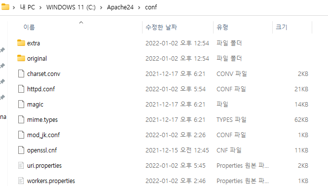
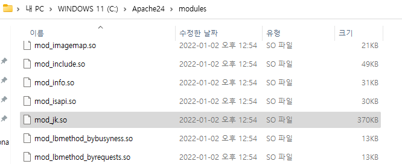
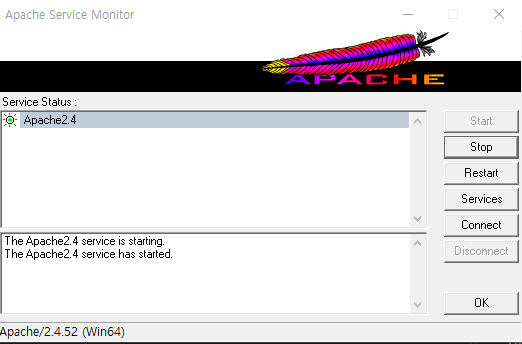
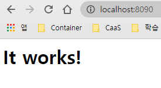
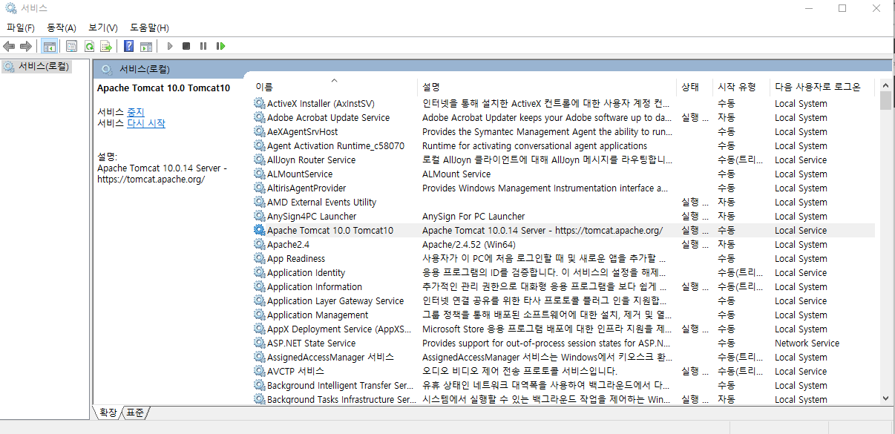
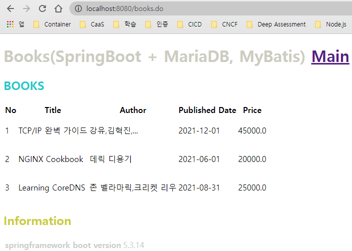

# [Apache](https://httpd.apache.org/) [2.4.52](https://www.apachelounge.com/download/) 
- 정적인 데이터를 처리하는 웹서버

  

## apache 의 httpd.conf  설정
- Apache 설치된 Directory 위치 조정 : C:\Apache24
- httpd conf 위치 : conf/httpd.conf
- Listen Port 설정
- mod_jk 사용 설정
  - 확장자 *.do 일 경우 jvm1(Tomcat) 에서 처리하도록 설정
  - workers.properties 설정
  - uri.properties 설정

### Document Root 지정
#### http.conf
  ```
  Define SRVROOT "C:/Apache24"
  
  ServerRoot "${SRVROOT}"
  .
  .
  .
  Listen 8080
  ```

### Tomcat 연동 설정(AJP 1.3)
#### module/mod_jk.so 설치
- "mod_jk-1.2.48-win64-VS16.zip"를 풀어 mod_jk.so 를 module 디렉토리 밑에 위치한다.
    

#### conf/workers.properties
- tomcat 하나만 연동하므로 worker list 는 하나("jvm1") 만 등록
  ```
  # worker.list=jvm1,jvm2
  worker.list=jvm1

  worker.jvm1.type=ajp13
  worker.jvm1.host=localhost
  worker.jvm1.port=8009
  worker.jvm1.lbfactor=1 # 서버 밸런스 비율


  # worker.jvm2.port=8109
  # worker.jvm2.host=localhost
  # worker.jvm2.type=ajp13
  # worker.jvm2.lbfactor=1
  ```

#### mod_jk 설정으로 *.do 파일의 경우 Tomcat 에서 처리하게 설정하기
- httpd.conf 와 workers.properties, uri.properties 를 통해 설정
- conf/httpd.conf
  ```
  .
  .
  .
  # mod_jk .모듈 설정
  LoadModule jk_module modules/mod_jk.so
  # include conf/mod_jk.conf

  # 설정 파일
  JkWorkersFile conf/workers.properties

  JkShmFile logs/mod_jk.shm

  # 로그 설정
  JkLogFile logs/mod_jk.log
  JkLogLevel info
  JkLogStampFormat "[%a %b %d %H:%M:%S %Y] "

  # JkMount /.jsp jvm1
  JKmount /*.do jvm1
  # JkMount /*/servlet/* jvm1
  JkRequestLogFormat "%w %V %T"

  # JkMountFile conf/uri.properties
  .
  .
  .
  ```

- workers.properties
  ```
  # worker.list=jvm1,jvm2
  worker.list=jvm1

  worker.jvm1.type=ajp13
  worker.jvm1.host=localhost
  worker.jvm1.port=8009
  worker.jvm1.lbfactor=1 # 서버 밸런스 비율


  # worker.jvm2.port=8109
  # worker.jvm2.host=localhost
  # worker.jvm2.type=ajp13
  # worker.jvm2.lbfactor=1
  ```

### uri.properties
  ```
  /*=jvm1
  /*.do=jvm1
  /*.jsp=jvm1
  /home.*=jvm1
  /books.*=jvm1

  !/=jvm1
  !/*.html=jvm1
  !/*.htm=jvm1
  !/*.Htm=jvm1
  !/*.hTm=jvm1
  !/*.htM=jvm1
  !/*.HTM=jvm1
  !/*.hTM=jvm1
  !/*.HtM=jvm1
  !/*.HTm=jvm1

  !/*.html=jvm1
  !/*.htmL=jvm1
  !/*.htMl=jvm1
  !/*.htML=jvm1
  !/*.hTml=jvm1
  !/*.hTmL=jvm1
  !/*.hTMl=jvm1
  !/*.hTML=jvm1

  !/*.Html=jvm1
  !/*.HtmL=jvm1
  !/*.HtMl=jvm1
  !/*.HtML=jvm1
  !/*.HTml=jvm1
  !/*.HTmL=jvm1
  !/*.HTMl=jvm1
  !/*.HTML=jvm1

  !/*.ico=jvm1
  !/*.icO=jvm1
  !/*.iCo=jvm1
  !/*.iCO=jvm1
  !/*.Ico=jvm1
  !/*.IcO=jvm1
  !/*.ICo=jvm1
  !/*.ICO=jvm1

  !/*.jpg=jvm1
  !/*.Jpg=jvm1
  !/*.jPg=jvm1
  !/*.jpG=jvm1
  !/*.JPG=jvm1
  !/*.jPG=jvm1
  !/*.JpG=jvm1
  !/*.JPg=jvm1

  !/*.png=jvm1
  !/*.Png=jvm1
  !/*.pNg=jvm1
  !/*.pnG=jvm1
  !/*.PNG=jvm1
  !/*.pNG=jvm1
  !/*.PnG=jvm1
  !/*.PNg=jvm1

  !/*.gif=jvm1
  !/*.Gif=jvm1
  !/*.gIf=jvm1
  !/*.giF=jvm1
  !/*.GIF=jvm1
  !/*.gIF=jvm1
  !/*.GiF=jvm1
  !/*.GIf=jvm1

  !/*.js=jvm1
  !/*.Js=jvm1
  !/*.jS=jvm1
  !/*.JS=jvm1

  !/*.css=jvm1
  !/*.Css=jvm1
  !/*.cSs=jvm1
  !/*.csS=jvm1
  !/*.CSS=jvm1
  !/*.cSS=jvm1
  !/*.CsS=jvm1
  !/*.CSs=jvm1

  !/*.txt=jvm1

  !/*.json=jvm1
  ```


## 서버 설치
```PowerShell
PS C:\Apache24\bin> ./httpd -k install
Installing the 'Apache2.4' service
The 'Apache2.4' service is successfully installed.
Testing httpd.conf....
Errors reported here must be corrected before the service can be started.
PS C:\Apache24\bin>                                                       
```

## 서버 제거
```PowerShell
PS C:\Apache24\bin>  ./httpd -k uninstall
Removing the 'Apache2.4' service
The 'Apache2.4' service has been removed successfully.
```

## 실행하기
- bin\ApacheMonitor.exe 를 관리자 권한으로 실행  





## .do 실행
### index.html 내용
- "location.href" 를 사용 home.do 로 바로 연계(홈에 접속시 tomat 의 /home.do 호출)
- index.html
  ```html
  <%@ page language="java" contentType="text/html; charset=UTF-8" pageEncoding="UTF-8"%>
  <!DOCTYPE html>
  <html xmlns="http://www.w3org/1999/xhtml" xml:lang="ko" lang="ko">
  <head>
  <meta http-equiv="Context-=Type" content="text/html; charset=utf-8" />
  <title>MAIN PAGE</title>
  <script type="text/javascript">
    location.href="/home.do";
  </script>
  </head>
  </html>
  ```
### 처리결과
- [http://localhost:8080/](http://localhost:8080/)
  
- [http://localhost:8080/](http://localhost:8080/)
  

