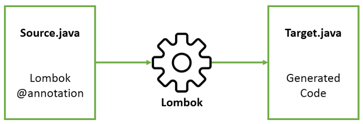

# [Lombok](https://projectlombok.org/)  

  

- Lombok 라이브러리는 반복적인 Getter/Setter, ToString 과 같은 반복적인 자바 코드를 컴파일할 때 자동으로 생성해주는 라이브러리 임
- 반복적인 소스코드를 제거할 수 있으므로 코드를 좀 더 깔끔하게 짤 수 있음
- VSCode 에서 lombok import나 Annotation 사용도 가능한데, 선언한 method들을 사용 못하는 경우 아래 Plugin을 설치 후 재기동해야 함

> [Lombok Plugin](https://marketplace.visualstudio.com/items?itemName=GabrielBB.vscode-lombok)  

## Lombok 어노테이션
| 어노테이션 | 설명 |
|:---|:---|
| @Getter/Setter | 코드를 컴파일할 때 속성들에 대한 Getter/Setter 메소드 생성 | 
| @ToString | toString( ) 메소드 생성 |  
| @ToString(exelude={"변수명"}) | 원하지 않는 속성을 제외한 toString( ) 메소드 생성 |  
| @NonNull | 해당 변수가 null 체크. NullPointerException 예외 발생 |  
| @EqualsAndHashCode | equals( ) 와 hashCode( ) 메소드 생성 |  
| @Builder | 빌더 패턴을 이용한 객체 생성 |  
| @NoArgsConstructor | 파리미터락 없는 기본 생성자 생성 |  
| @AllArgsConstructor | 모든 속성에 대한 생성자 생성 |  
| @RequiredArgsConstructor | 초기화되 않은 Final, @NonNull 어노테이션이 붙은 필드에 대한 생성자 생성 |  
| @Log | log 변수 자동 생성 |  
| @Value | 불변(immutable) 클래스 생성 |  
| @Data | @ToSting, @EqualsAndHashCode, @Getter, @Setter, @RequiredArgsConstructor 를 합친 어노테이션 |  

## Maven
### Pom.xml
```xml
<dependency>
  <groupId>org.projectlombok</groupId>
  <artifactId>lombok</artifactId>
  <version>1.18.22</version>
  <scope>provided</scope>
</dependency>
```

### JDK9+
```xml
<annotationProcessorPaths>
	<path>
		<groupId>org.projectlombok</groupId>
		<artifactId>lombok</artifactId>
		<version>1.18.22</version>
	</path>
</annotationProcessorPaths>
```

### [Lombok Maven Plugin](http://anthonywhitford.com/lombok.maven/lombok-maven-plugin/)  