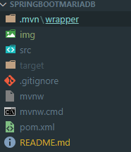
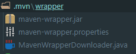

# Maven
- 자바 프로젝트 빌드 자동화 도구
## [Maven 래퍼에 대한 빠른 가이드](https://www.baeldung.com/maven-wrapper)


### Maven Diretory



### mvn
- mvn -N io.takari:maven:wrapper
- mvn -N io.takari:maven:wrapper -Dmaven=3.5.2
  - -N : non-recursive 를 의미 현재 디렉토리의 기본 프로젝트에만 적용
### Maven Warpper
- Maven 을 별도의 환경에서 개발할 때 local machine 에 다로 설치를 원하지 않거나 Maven 의 특정 버전을 빌드하길 원할 때 사용
### Maven Wrapper 구성
#### mvnw
- mvnw 는 maven 대신에 사용되는 실행가능한 unix shell script 입니다.
#### mvnw.cmd
- mvnw 의 윈도우 배치 버전 shell script 입니다.

#### .mvn directory
- 아래 3개의 파일 있으며, 이 파일들을 통해서 Maven 이 존재하지 않아도 특정 버전과 classpath 를 가지고 공통된 Maven 을 다운로드 및 사용할 수 있게 됩니다.  
  
  | File | 설명 |
  |:---|:---|
  | MavenWrapperDownloader.java | java class file 인 이 파일을 compiling 및 실행하여 Maven 가 다운로드 되어집니다. |  
  | maven-wrapper.jar | wrapper shell scripts 로 부터 maven 을 실행하고, 다운로드 하는데 사용됩니다. |  
  | maven-wrapper.properties | Maven 이 존재하지 않는 경우 다운로드하기 위한 URL 을 명시하기 위해서 사용됩니다. |  

### Maven 명령어
| 명령 | 설명 | 
|:---|:---|  
| compile | 컴파일 수행 |
| test | 컴파일 수행 후 테스트 클래스 수행 |
| package | 컴파일을 수행하고 컴파일한 소스를 packaging 양식(war or jar)에 맞춰 프로젝트 내 지정한 경로(eg.target) 디렉토리에 생성 |
| install | package 한것에 추가적으로 로컬 repository에 배포한다.  |
| deploy | install 한것에 추가적으로 원격 repository(nexus)에 배포한다. |
| clean | maven build 시 생성된 모든 것들을 삭제한다. |  

### Maven 옵션
| 옵션 | 설명 | 
|:---|:---|  
| -am,--also-make | 프로젝트 목록이 지정된 경우 목록에 필요한 프로젝트도 빌드하십시오. |
| -amd,--also-make-dependents | 프로젝트 목록이 지정된 경우 목록의 프로젝트에 의존하는 프로젝트도 빌드하십시오. | 
| -B,--batch-mode | 비 대화식 (일괄 처리) 모드에서 실행 (출력 색상 비활성화) | 
| -b,--builder | 사용할 빌드 전략의 ID |
| -C,--strict-checksums | 체크섬이 일치하지 않으면 빌드 실패 |  
| -c,--lax-checksums | 체크섬이 일치하지 않으면 경고 |  
| -cpu,--check-plugin-updates | 비효율적이며 이전 버전과의 호환성을 위해서만 유지|
| -D,--define |시스템 속성 정의 |  
| -e,--errors | 실행 오류 메시지 생성 |  
| -emp,--encrypt-master-password | 마스터 보안 비밀번호 암호화  |  
| -ep,--encrypt-password | 서버 비밀번호 암호화 | 
| -f,--file | 대체 POM 파일 (또는 pom.xml이있는 디렉토리)을 사용하도록합니다. |
| -fae,--fail-at-end | 이후에는 빌드에 실패합니다. 영향을받지 않은 모든 빌드가 계속되도록 허용 |
| -ff,--fail-fast | 원자로 빌드에서 처음 실패시 중지 |
| -fn,--fail-never | 프로젝트 결과에 관계없이 빌드에 실패하지 마십시오. |
| -gs,--global-settings | 글로벌 설정 파일의 대체 경로 |
| -gt,--global-toolchains 글로벌 툴체인 파일의 대체 경로 |
| -h,--help | 도움말 정보 표시 |
| -l,--log-file | 모든 빌드 출력이 진행되는 로그 파일 (출력 색상 비활성화) | 
| -llr,--legacy-local-repository | Maven 2 레거시 로컬 리포지토리 동작, 즉 _remote.repositories를 사용하지 마십시오.  -Dmaven.legacyLocalRepo = true를 사용하여 활성화 할 수도 있습니다. |
| -N,--non-recursive | 하위 프로젝트로 재귀하지 마십시오 |
| -npr,--no-plugin-registry | 비효율적이며 이전 버전과의 호환성을 위해서만 유지 | 
| -npu,--no-plugin-updates | 비효율적이며 이전 버전과의 호환성을 위해서만 유지 | 
| -nsu,--no-snapshot-updates | SNAPSHOT 업데이트 억제 |
| -ntp,--no-transfer-progress | 다운로드 또는 업로드시 전송 진행률을 표시하지 않습니다 |
| -o,--offline | 오프라인으로 작업 |
| -P,--activate-profiles | 활성화 할 쉼표로 구분 된 프로파일 목록 |
| -pl,--projects | 모든 프로젝트 대신 빌드 할 지정된 원자로 프로젝트의 쉼표로 구분 된 목록입니다. [groupId] : artifactId 또는 상대 경로로 프로젝트를 지정할 수 있습니다. |
| -q,--quiet | 조용한 출력-오류 만 표시 |
| -rf,--resume-from | 지정된 프로젝트에서 원자로 재개 |
| -s,--settings | 사용자 설정 파일의 대체 경로 |
| -t,--toolchains | 사용자 툴체인 파일의 대체 경로 |
| -T,--threads | 스레드 수 (예 : C에 코어를 곱한 2.0C) |
| -U,--update-snapshots | 원격 리포지토리에서 누락 된 릴리스 및 업데이트 된 스냅 샷을 검사합니다. |
| -up,--update-plugins | 비효율적이며 이전 버전과의 호환성을 위해서만 유지 |
| -v,--version | 버전 정보 표시 -V,--show-version 빌드를 중단하지 않고 버전 정보 표시 | 
| -X,--debug | 실행 디버그 출력 생성 | 


### Maven Wrapper 실행하기
| 명령/경로 | 설명 | 
|:---|:---|  
| ./mvnw clean install | Maven/target install |  
| ./mvnw clean package | Maven/target clean 및 build |  
| ./mvnw spring-boot:run | Maven 으로 Springboot 실행 |  
| ~/.m2/wrapper/dists | mvnw 로 설치된 maven 배포 경로 |


## 빌드 : ./mvnw clean install 
```
PS C:\workspace\SpringBootMariaDB> ./mvnw clean install

[INFO] Scanning for projects...
[INFO] 
[INFO] --------------------< com.example:SpringBootSample >--------------------
[INFO] Building SpringBootSample 0.0.1-SNAPSHOT
[INFO] --------------------------------[ war ]---------------------------------
Downloading from central: https://repo.maven.apache.org/maven2/org/apache/maven/plugins/maven-war-plugin/3.2.3/maven-war-plugin-3.2.3.pom
Downloaded from central: https://repo.maven.apache.org/maven2/org/apache/maven/plugins/maven-war-plugin/3.2.3/maven-war-plugin-3.2.3.pom (9.6 kB at 10 kB/s)
[INFO] 
[INFO] --- maven-clean-plugin:3.1.0:clean (default-clean) @ SpringBootSample ---
[INFO] 
[INFO] --- maven-resources-plugin:3.1.0:resources (default-resources) @ SpringBootSample ---
[INFO] Using 'UTF-8' encoding to copy filtered resources.
[INFO] Copying 1 resource
[INFO] Copying 1 resource
[INFO] 
[INFO] --- maven-compiler-plugin:3.8.1:compile (default-compile) @ SpringBootSample ---
[INFO] Changes detected - recompiling the module!
[INFO] Compiling 8 source files to C:\workspace\SpringBootMariaDB\target\classes
[INFO] 
[INFO] --- maven-resources-plugin:3.1.0:testResources (default-testResources) @ SpringBootSample ---
[INFO] Using 'UTF-8' encoding to copy filtered resources.
[INFO] skip non existing resourceDirectory C:\workspace\SpringBootMariaDB\src\test\resources
[INFO]
[INFO] --- maven-compiler-plugin:3.8.1:testCompile (default-testCompile) @ SpringBootSample ---
[INFO] Changes detected - recompiling the module!
[INFO] Compiling 1 source file to C:\workspace\SpringBootMariaDB\target\test-classes
[INFO] 
[INFO] --- maven-surefire-plugin:2.22.2:test (default-test) @ SpringBootSample ---
Downloading from central: https://repo.maven.apache.org/maven2/org/apache/maven/surefire/surefire-junit-platform/2.22.2/surefire-junit-platform-2.22.2.pom
Downloaded from central: https://repo.maven.apache.org/maven2/org/apache/maven/surefire/surefire-junit-platform/2.22.2/surefire-junit-platform-2.22.2.pom (7.0 kB at 22 kB/s)
Downloading from central: https://repo.maven.apache.org/maven2/org/apache/maven/surefire/surefire-providers/2.22.2/surefire-providers-2.22.2.pom
Downloaded from central: https://repo.maven.apache.org/maven2/org/apache/maven/surefire/surefire-providers/2.22.2/surefire-providers-2.22.2.pom (2.5 kB at 8.4 kB/s)
Downloading from central: https://repo.maven.apache.org/maven2/org/junit/platform/junit-platform-launcher/1.3.1/junit-platform-launcher-1.3.1.pom
Downloaded from central: https://repo.maven.apache.org/maven2/org/junit/platform/junit-platform-launcher/1.3.1/junit-platform-launcher-1.3.1.pom (2.2 kB at 6.8 kB/s)
Downloading from central: https://repo.maven.apache.org/maven2/org/apiguardian/apiguardian-api/1.0.0/apiguardian-api-1.0.0.pom
Downloaded from central: https://repo.maven.apache.org/maven2/org/apiguardian/apiguardian-api/1.0.0/apiguardian-api-1.0.0.pom (1.2 kB at 4.0 kB/s)
Downloading from central: https://repo.maven.apache.org/maven2/org/junit/platform/junit-platform-engine/1.3.1/junit-platform-engine-1.3.1.pom
Downloaded from central: https://repo.maven.apache.org/maven2/org/junit/platform/junit-platform-engine/1.3.1/junit-platform-engine-1.3.1.pom (2.4 kB at 8.1 kB/s)
Downloading from central: https://repo.maven.apache.org/maven2/org/junit/platform/junit-platform-commons/1.3.1/junit-platform-commons-1.3.1.pom
Downloaded from central: https://repo.maven.apache.org/maven2/org/junit/platform/junit-platform-commons/1.3.1/junit-platform-commons-1.3.1.pom (2.0 kB at 6.8 kB/s)
Downloading from central: https://repo.maven.apache.org/maven2/org/opentest4j/opentest4j/1.1.1/opentest4j-1.1.1.pom
Downloaded from central: https://repo.maven.apache.org/maven2/org/opentest4j/opentest4j/1.1.1/opentest4j-1.1.1.pom (1.7 kB at 5.8 kB/s)
Downloading from central: https://repo.maven.apache.org/maven2/org/junit/platform/junit-platform-commons/1.3.1/junit-platform-commons-1.3.1.jar
Downloading from central: https://repo.maven.apache.org/maven2/org/junit/platform/junit-platform-engine/1.3.1/junit-platform-engine-1.3.1.jar
Downloading from central: https://repo.maven.apache.org/maven2/org/apache/maven/surefire/surefire-junit-platform/2.22.2/surefire-junit-platform-2.22.2.jar
Downloading from central: https://repo.maven.apache.org/maven2/org/junit/platform/junit-platform-launcher/1.3.1/junit-platform-launcher-1.3.1.jar
Downloading from central: https://repo.maven.apache.org/maven2/org/apiguardian/apiguardian-api/1.0.0/apiguardian-api-1.0.0.jar
Downloaded from central: https://repo.maven.apache.org/maven2/org/junit/platform/junit-platform-commons/1.3.1/junit-platform-commons-1.3.1.jar (78 kB at 159 kB/s)
Downloading from central: https://repo.maven.apache.org/maven2/org/opentest4j/opentest4j/1.1.1/opentest4j-1.1.1.jar
Downloaded from central: https://repo.maven.apache.org/maven2/org/apiguardian/apiguardian-api/1.0.0/apiguardian-api-1.0.0.jar (2.2 kB at 3.5 kB/s)
Downloaded from central: https://repo.maven.apache.org/maven2/org/apache/maven/surefire/surefire-junit-platform/2.22.2/surefire-junit-platform-2.22.2.jar (66 kB at 85 kB/s)
Downloaded from central: https://repo.maven.apache.org/maven2/org/opentest4j/opentest4j/1.1.1/opentest4j-1.1.1.jar (7.1 kB at 23 kB/s)
Downloaded from central: https://repo.maven.apache.org/maven2/org/junit/platform/junit-platform-launcher/1.3.1/junit-platform-launcher-1.3.1.jar (95 kB at 114 kB/s)
Downloaded from central: https://repo.maven.apache.org/maven2/org/junit/platform/junit-platform-engine/1.3.1/junit-platform-engine-1.3.1.jar (135 kB at 147 kB/s)
[INFO] 
[INFO] -------------------------------------------------------
[INFO]  T E S T S
[INFO] -------------------------------------------------------
[INFO] Running com.example.demo.SpringBootSampleApplicationTests
21:22:25.057 [main] DEBUG org.springframework.test.context.BootstrapUtils - Instantiating CacheAwareContextLoaderDelegate from class [org.springframework.test.context.cache.DefaultCacheAwareContextLoaderDelegate]
21:22:25.068 [main] DEBUG org.springframework.test.context.BootstrapUtils - Instantiating BootstrapContext using constructor [public org.springframework.test.context.support.DefaultBootstrapContext(java.lang.Class,org.springframework.test.context.CacheAwareContextLoaderDelegate)]
21:22:25.097 [main] DEBUG org.springframework.test.context.BootstrapUtils - Instantiating TestContextBootstrapper for test class [com.example.demo.SpringBootSampleApplicationTests] from class [org.springframework.boot.test.context.SpringBootTestContextBootstrapper]
21:22:25.114 [main] INFO org.springframework.boot.test.context.SpringBootTestContextBootstrapper - Neither @ContextConfiguration nor @ContextHierarchy found for test class [com.example.demo.SpringBootSampleApplicationTests], using SpringBootContextLoader
21:22:25.118 [main] DEBUG org.springframework.test.context.support.AbstractContextLoader - Did not detect default resource location for test class [com.example.demo.SpringBootSampleApplicationTests]: class path resource [com/example/demo/SpringBootSampleApplicationTests-context.xml] does not exist
21:22:25.119 [main] DEBUG org.springframework.test.context.support.AbstractContextLoader - Did not detect default resource location for test class [com.example.demo.SpringBootSampleApplicationTests]: class path resource [com/example/demo/SpringBootSampleApplicationTestsContext.groovy] does not exist
21:22:25.119 [main] INFO org.springframework.test.context.support.AbstractContextLoader - Could not detect default resource locations for test class [com.example.demo.SpringBootSampleApplicationTests]: no resource found for suffixes {-context.xml, Context.groovy}.
21:22:25.120 [main] INFO org.springframework.test.context.support.AnnotationConfigContextLoaderUtils - Could not detect default configuration classes for test class [com.example.demo.SpringBootSampleApplicationTests]: SpringBootSampleApplicationTests does not declare any static, non-private, non-final, nested classes annotated with @Configuration.
21:22:25.154 [main] DEBUG org.springframework.test.context.support.ActiveProfilesUtils - Could not find an 'annotation declaring class' for annotation type [org.springframework.test.context.ActiveProfiles] and class [com.example.demo.SpringBootSampleApplicationTests]
21:22:25.212 [main] DEBUG org.springframework.context.annotation.ClassPathScanningCandidateComponentProvider - Identified candidate component class: file [C:\workspace\SpringBootMariaDB\target\classes\com\example\demo\SpringBootSampleApplication.class]
21:22:25.213 [main] INFO org.springframework.boot.test.context.SpringBootTestContextBootstrapper - Found @SpringBootConfiguration com.example.demo.SpringBootSampleApplication for test class com.example.demo.SpringBootSampleApplicationTests
21:22:25.313 [main] DEBUG org.springframework.boot.test.context.SpringBootTestContextBootstrapper - @TestExecutionListeners is not present for class [com.example.demo.SpringBootSampleApplicationTests]: using defaults.
21:22:25.313 [main] INFO org.springframework.boot.test.context.SpringBootTestContextBootstrapper - Loaded default TestExecutionListener class names from location [META-INF/spring.factories]: [org.springframework.boot.test.mock.mockito.MockitoTestExecutionListener, org.springframework.boot.test.mock.mockito.ResetMocksTestExecutionListener, org.springframework.boot.test.autoconfigure.restdocs.RestDocsTestExecutionListener, org.springframework.boot.test.autoconfigure.web.client.MockRestServiceServerResetTestExecutionListener, org.springframework.boot.test.autoconfigure.web.servlet.MockMvcPrintOnlyOnFailureTestExecutionListener, org.springframework.boot.test.autoconfigure.web.servlet.WebDriverTestExecutionListener, org.springframework.test.context.web.ServletTestExecutionListener, org.springframework.test.context.support.DirtiesContextBeforeModesTestExecutionListener, org.springframework.test.context.support.DependencyInjectionTestExecutionListener, org.springframework.test.context.support.DirtiesContextTestExecutionListener, org.springframework.test.context.transaction.TransactionalTestExecutionListener, org.springframework.test.context.jdbc.SqlScriptsTestExecutionListener, org.springframework.test.context.event.EventPublishingTestExecutionListener]
21:22:25.326 [main] INFO org.springframework.boot.test.context.SpringBootTestContextBootstrapper - Using TestExecutionListeners: [org.springframework.test.context.web.ServletTestExecutionListener@25a6944c, org.springframework.test.context.support.DirtiesContextBeforeModesTestExecutionListener@5e1fa5b1, org.springframework.boot.test.mock.mockito.MockitoTestExecutionListener@6b00f608, org.springframework.boot.test.autoconfigure.SpringBootDependencyInjectionTestExecutionListener@2f17e30d, org.springframework.test.context.support.DirtiesContextTestExecutionListener@3e821657, org.springframework.test.context.transaction.TransactionalTestExecutionListener@1d131e1b, org.springframework.test.context.jdbc.SqlScriptsTestExecutionListener@71cf1b07, org.springframework.test.context.event.EventPublishingTestExecutionListener@615091b8, org.springframework.boot.test.mock.mockito.ResetMocksTestExecutionListener@4fce136b, org.springframework.boot.test.autoconfigure.restdocs.RestDocsTestExecutionListener@4aa83f4f, org.springframework.boot.test.autoconfigure.web.client.MockRestServiceServerResetTestExecutionListener@43b6123e, org.springframework.boot.test.autoconfigure.web.servlet.MockMvcPrintOnlyOnFailureTestExecutionListener@260e86a1, org.springframework.boot.test.autoconfigure.web.servlet.WebDriverTestExecutionListener@19648c40]
21:22:25.329 [main] DEBUG org.springframework.test.context.support.AbstractDirtiesContextTestExecutionListener - Before test class: context [DefaultTestContext@1d2bd371 testClass = SpringBootSampleApplicationTests, testInstance = [null], testMethod = [null], testException = [null], mergedContextConfiguration = [WebMergedContextConfiguration@44040454 testClass = SpringBootSampleApplicationTests, locations = '{}', classes = '{class com.example.demo.SpringBootSampleApplication}', contextInitializerClasses = '[]', activeProfiles = '{}', propertySourceLocations = '{}', propertySourceProperties = '{org.springframework.boot.test.context.SpringBootTestContextBootstrapper=true}', contextCustomizers = set[org.springframework.boot.test.context.filter.ExcludeFilterContextCustomizer@5f9edf14, org.springframework.boot.test.json.DuplicateJsonObjectContextCustomizerFactory$DuplicateJsonObjectContextCustomizer@68878f6d, org.springframework.boot.test.mock.mockito.MockitoContextCustomizer@0, org.springframework.boot.test.web.client.TestRestTemplateContextCustomizer@4c2bb6e0, org.springframework.boot.test.autoconfigure.properties.PropertyMappingContextCustomizer@0, org.springframework.boot.test.autoconfigure.web.servlet.WebDriverContextCustomizerFactory$Customizer@2462cb01], resourceBasePath = 'src/main/webapp', contextLoader = 'org.springframework.boot.test.context.SpringBootContextLoader', parent = [null]], attributes = map['org.springframework.test.context.web.ServletTestExecutionListener.activateListener' -> true]], class annotated with @DirtiesContext [false] with mode [null].
21:22:25.350 [main] DEBUG org.springframework.test.context.support.TestPropertySourceUtils - Adding inlined properties to environment: {spring.jmx.enabled=false, org.springframework.boot.test.context.SpringBootTestContextBootstrapper=true, server.port=-1}

  .   ____          _            __ _ _
 /\\ / ___'_ __ _ _(_)_ __  __ _ \ \ \ \
( ( )\___ | '_ | '_| | '_ \/ _` | \ \ \ \
 \\/  ___)| |_)| | | | | || (_| |  ) ) ) )
  '  |____| .__|_| |_|_| |_\__, | / / / /
 =========|_|==============|___/=/_/_/_/
 :: Spring Boot ::        (v2.2.3.RELEASE)

2021-12-25 21:22:25.614  INFO 10900 --- [           main] c.e.d.SpringBootSampleApplicationTests   : Starting SpringBootSampleApplicationTests on DESKTOP-QR555PR with PID 10900 (started by taeey in C:\workspace\SpringBootMariaDB)
2021-12-25 21:22:25.615  INFO 10900 --- [           main] c.e.d.SpringBootSampleApplicationTests   : No active profile set, falling back to default profiles: default
2021-12-25 21:22:26.855  INFO 10900 --- [           main] o.s.s.concurrent.ThreadPoolTaskExecutor  : Initializing ExecutorService 'applicationTaskExecutor'
2021-12-25 21:22:27.120  INFO 10900 --- [           main] c.e.d.SpringBootSampleApplicationTests   : Started SpringBootSampleApplicationTests in 1.763 seconds (JVM running for 2.565)
[INFO] Tests run: 1, Failures: 0, Errors: 0, Skipped: 0, Time elapsed: 2.434 s - in com.example.demo.SpringBootSampleApplicationTests
2021-12-25 21:22:27.464  INFO 10900 --- [extShutdownHook] o.s.s.concurrent.ThreadPoolTaskExecutor  : Shutting down ExecutorService 'applicationTaskExecutor'
[INFO] 
[INFO] Results:
[INFO]
[INFO] Tests run: 1, Failures: 0, Errors: 0, Skipped: 0
[INFO]
[INFO]
[INFO] --- maven-war-plugin:3.2.3:war (default-war) @ SpringBootSample ---
Downloading from central: https://repo.maven.apache.org/maven2/org/apache/maven/maven-archiver/3.4.0/maven-archiver-3.4.0.pom
Downloaded from central: https://repo.maven.apache.org/maven2/org/apache/maven/maven-archiver/3.4.0/maven-archiver-3.4.0.pom (4.6 kB at 14 kB/s)
Downloading from central: https://repo.maven.apache.org/maven2/org/codehaus/plexus/plexus-archiver/4.1.0/plexus-archiver-4.1.0.pom
Downloaded from central: https://repo.maven.apache.org/maven2/org/codehaus/plexus/plexus-archiver/4.1.0/plexus-archiver-4.1.0.pom (4.8 kB at 16 kB/s)
Downloading from central: https://repo.maven.apache.org/maven2/org/codehaus/plexus/plexus-io/3.1.1/plexus-io-3.1.1.pom
Downloaded from central: https://repo.maven.apache.org/maven2/org/codehaus/plexus/plexus-io/3.1.1/plexus-io-3.1.1.pom (4.5 kB at 15 kB/s)
Downloading from central: https://repo.maven.apache.org/maven2/org/apache/commons/commons-compress/1.18/commons-compress-1.18.pom
Downloaded from central: https://repo.maven.apache.org/maven2/org/apache/commons/commons-compress/1.18/commons-compress-1.18.pom (18 kB at 60 kB/s)
Downloading from central: https://repo.maven.apache.org/maven2/com/thoughtworks/xstream/xstream/1.4.10/xstream-1.4.10.pom
Downloaded from central: https://repo.maven.apache.org/maven2/com/thoughtworks/xstream/xstream/1.4.10/xstream-1.4.10.pom (15 kB at 49 kB/s)
Downloading from central: https://repo.maven.apache.org/maven2/com/thoughtworks/xstream/xstream-parent/1.4.10/xstream-parent-1.4.10.pom
Downloaded from central: https://repo.maven.apache.org/maven2/com/thoughtworks/xstream/xstream-parent/1.4.10/xstream-parent-1.4.10.pom (35 kB at 113 kB/s)
Downloading from central: https://repo.maven.apache.org/maven2/org/apache/maven/shared/maven-mapping/3.0.0/maven-mapping-3.0.0.pom
Downloaded from central: https://repo.maven.apache.org/maven2/org/apache/maven/shared/maven-mapping/3.0.0/maven-mapping-3.0.0.pom (4.1 kB at 14 kB/s)
Downloading from central: https://repo.maven.apache.org/maven2/org/codehaus/plexus/plexus-interpolation/1.21/plexus-interpolation-1.21.pom
Downloaded from central: https://repo.maven.apache.org/maven2/org/codehaus/plexus/plexus-interpolation/1.21/plexus-interpolation-1.21.pom (1.5 kB at 5.0 kB/s)
Downloading from central: https://repo.maven.apache.org/maven2/org/apache/maven/maven-archiver/3.4.0/maven-archiver-3.4.0.jar
Downloading from central: https://repo.maven.apache.org/maven2/org/codehaus/plexus/plexus-interpolation/1.25/plexus-interpolation-1.25.jar
Downloading from central: https://repo.maven.apache.org/maven2/org/apache/commons/commons-compress/1.18/commons-compress-1.18.jar
Downloading from central: https://repo.maven.apache.org/maven2/org/codehaus/plexus/plexus-io/3.1.1/plexus-io-3.1.1.jar
Downloading from central: https://repo.maven.apache.org/maven2/org/codehaus/plexus/plexus-archiver/4.1.0/plexus-archiver-4.1.0.jar
Downloaded from central: https://repo.maven.apache.org/maven2/org/apache/maven/maven-archiver/3.4.0/maven-archiver-3.4.0.jar (24 kB at 78 kB/s)
Downloading from central: https://repo.maven.apache.org/maven2/com/thoughtworks/xstream/xstream/1.4.10/xstream-1.4.10.jar
Downloaded from central: https://repo.maven.apache.org/maven2/org/codehaus/plexus/plexus-interpolation/1.25/plexus-interpolation-1.25.jar (85 kB at 188 kB/s)
Downloading from central: https://repo.maven.apache.org/maven2/org/apache/maven/shared/maven-mapping/3.0.0/maven-mapping-3.0.0.jar
Downloaded from central: https://repo.maven.apache.org/maven2/org/codehaus/plexus/plexus-io/3.1.1/plexus-io-3.1.1.jar (75 kB at 142 kB/s)
Downloaded from central: https://repo.maven.apache.org/maven2/org/codehaus/plexus/plexus-archiver/4.1.0/plexus-archiver-4.1.0.jar (192 kB at 327 kB/s)
Downloaded from central: https://repo.maven.apache.org/maven2/org/apache/maven/shared/maven-mapping/3.0.0/maven-mapping-3.0.0.jar (11 kB at 14 kB/s)
Downloaded from central: https://repo.maven.apache.org/maven2/org/apache/commons/commons-compress/1.18/commons-compress-1.18.jar (592 kB at 603 kB/s)
Downloaded from central: https://repo.maven.apache.org/maven2/com/thoughtworks/xstream/xstream/1.4.10/xstream-1.4.10.jar (590 kB at 581 kB/s)
[INFO] Packaging webapp
[INFO] Assembling webapp [SpringBootSample] in [C:\workspace\SpringBootMariaDB\target\SpringBootSample-0.0.1-SNAPSHOT]
[INFO] Processing war project
[INFO] Copying webapp resources [C:\workspace\SpringBootMariaDB\src\main\webapp]
[INFO] Webapp assembled in [215 msecs]
[INFO] Building war: C:\workspace\SpringBootMariaDB\target\SpringBootSample-0.0.1-SNAPSHOT.war
[INFO] 
[INFO] --- spring-boot-maven-plugin:2.2.3.RELEASE:repackage (repackage) @ SpringBootSample ---
Downloading from central: https://repo.maven.apache.org/maven2/org/springframework/boot/spring-boot-loader-tools/2.2.3.RELEASE/spring-boot-loader-tools-2.2.3.RELEASE.pom
Downloaded from central: https://repo.maven.apache.org/maven2/org/springframework/boot/spring-boot-loader-tools/2.2.3.RELEASE/spring-boot-loader-tools-2.2.3.RELEASE.pom (2.5 kB at 8.4 kB/s)
Downloading from central: https://repo.maven.apache.org/maven2/org/apache/maven/maven-artifact/3.3.9/maven-artifact-3.3.9.pom
Downloaded from central: https://repo.maven.apache.org/maven2/org/apache/maven/maven-artifact/3.3.9/maven-artifact-3.3.9.pom (2.1 kB at 7.3 kB/s)
Downloading from central: https://repo.maven.apache.org/maven2/org/apache/maven/maven/3.3.9/maven-3.3.9.pom
Downloaded from central: https://repo.maven.apache.org/maven2/org/apache/maven/maven/3.3.9/maven-3.3.9.pom (24 kB at 77 kB/s)
Downloading from central: https://repo.maven.apache.org/maven2/org/apache/commons/commons-lang3/3.9/commons-lang3-3.9.pom
Downloaded from central: https://repo.maven.apache.org/maven2/org/apache/commons/commons-lang3/3.9/commons-lang3-3.9.pom (28 kB at 95 kB/s)
Downloading from central: https://repo.maven.apache.org/maven2/org/apache/maven/maven-core/3.3.9/maven-core-3.3.9.pom
Downloaded from central: https://repo.maven.apache.org/maven2/org/apache/maven/maven-core/3.3.9/maven-core-3.3.9.pom (8.3 kB at 28 kB/s)
Downloading from central: https://repo.maven.apache.org/maven2/org/apache/maven/maven-model/3.3.9/maven-model-3.3.9.pom
Downloaded from central: https://repo.maven.apache.org/maven2/org/apache/maven/maven-model/3.3.9/maven-model-3.3.9.pom (4.0 kB at 14 kB/s)
Downloading from central: https://repo.maven.apache.org/maven2/org/apache/maven/maven-settings/3.3.9/maven-settings-3.3.9.pom
Downloaded from central: https://repo.maven.apache.org/maven2/org/apache/maven/maven-settings/3.3.9/maven-settings-3.3.9.pom (1.8 kB at 6.3 kB/s)
Downloading from central: https://repo.maven.apache.org/maven2/org/apache/maven/maven-settings-builder/3.3.9/maven-settings-builder-3.3.9.pom
Downloaded from central: https://repo.maven.apache.org/maven2/org/apache/maven/maven-settings-builder/3.3.9/maven-settings-builder-3.3.9.pom (2.6 kB at 9.0 kB/s)
Downloading from central: https://repo.maven.apache.org/maven2/org/apache/maven/maven-builder-support/3.3.9/maven-builder-support-3.3.9.pom
Downloaded from central: https://repo.maven.apache.org/maven2/org/apache/maven/maven-builder-support/3.3.9/maven-builder-support-3.3.9.pom (1.7 kB at 5.7 kB/s)
Downloading from central: https://repo.maven.apache.org/maven2/org/apache/maven/maven-repository-metadata/3.3.9/maven-repository-metadata-3.3.9.pom
Downloaded from central: https://repo.maven.apache.org/maven2/org/apache/maven/maven-repository-metadata/3.3.9/maven-repository-metadata-3.3.9.pom (1.9 kB at 6.5 kB/s)
Downloading from central: https://repo.maven.apache.org/maven2/org/apache/maven/maven-plugin-api/3.3.9/maven-plugin-api-3.3.9.pom
Downloaded from central: https://repo.maven.apache.org/maven2/org/apache/maven/maven-plugin-api/3.3.9/maven-plugin-api-3.3.9.pom (2.7 kB at 9.2 kB/s)
Downloading from central: https://repo.maven.apache.org/maven2/org/eclipse/sisu/org.eclipse.sisu.plexus/0.3.2/org.eclipse.sisu.plexus-0.3.2.pom
Downloaded from central: https://repo.maven.apache.org/maven2/org/eclipse/sisu/org.eclipse.sisu.plexus/0.3.2/org.eclipse.sisu.plexus-0.3.2.pom (4.2 kB at 14 kB/s)
Downloading from central: https://repo.maven.apache.org/maven2/org/eclipse/sisu/sisu-plexus/0.3.2/sisu-plexus-0.3.2.pom
Downloaded from central: https://repo.maven.apache.org/maven2/org/eclipse/sisu/sisu-plexus/0.3.2/sisu-plexus-0.3.2.pom (14 kB at 47 kB/s)
Downloading from central: https://repo.maven.apache.org/maven2/org/eclipse/sisu/org.eclipse.sisu.inject/0.3.2/org.eclipse.sisu.inject-0.3.2.pom
Downloaded from central: https://repo.maven.apache.org/maven2/org/eclipse/sisu/org.eclipse.sisu.inject/0.3.2/org.eclipse.sisu.inject-0.3.2.pom (2.6 kB at 9.0 kB/s)
Downloading from central: https://repo.maven.apache.org/maven2/org/eclipse/sisu/sisu-inject/0.3.2/sisu-inject-0.3.2.pom
Downloaded from central: https://repo.maven.apache.org/maven2/org/eclipse/sisu/sisu-inject/0.3.2/sisu-inject-0.3.2.pom (14 kB at 49 kB/s)
Downloading from central: https://repo.maven.apache.org/maven2/org/apache/maven/maven-model-builder/3.3.9/maven-model-builder-3.3.9.pom
Downloaded from central: https://repo.maven.apache.org/maven2/org/apache/maven/maven-model-builder/3.3.9/maven-model-builder-3.3.9.pom (3.1 kB at 11 kB/s)
Downloading from central: https://repo.maven.apache.org/maven2/com/google/guava/guava/18.0/guava-18.0.pom
Downloaded from central: https://repo.maven.apache.org/maven2/com/google/guava/guava/18.0/guava-18.0.pom (5.7 kB at 19 kB/s)
Downloading from central: https://repo.maven.apache.org/maven2/com/google/guava/guava-parent/18.0/guava-parent-18.0.pom
Downloaded from central: https://repo.maven.apache.org/maven2/com/google/guava/guava-parent/18.0/guava-parent-18.0.pom (7.7 kB at 26 kB/s)
Downloading from central: https://repo.maven.apache.org/maven2/org/apache/maven/maven-aether-provider/3.3.9/maven-aether-provider-3.3.9.pom
Downloaded from central: https://repo.maven.apache.org/maven2/org/apache/maven/maven-aether-provider/3.3.9/maven-aether-provider-3.3.9.pom (4.0 kB at 14 kB/s)
Downloading from central: https://repo.maven.apache.org/maven2/org/eclipse/aether/aether-api/1.0.2.v20150114/aether-api-1.0.2.v20150114.pom
Downloaded from central: https://repo.maven.apache.org/maven2/org/eclipse/aether/aether-api/1.0.2.v20150114/aether-api-1.0.2.v20150114.pom (1.8 kB at 6.2 kB/s)
Downloading from central: https://repo.maven.apache.org/maven2/org/eclipse/aether/aether/1.0.2.v20150114/aether-1.0.2.v20150114.pom
Downloaded from central: https://repo.maven.apache.org/maven2/org/eclipse/aether/aether/1.0.2.v20150114/aether-1.0.2.v20150114.pom (29 kB at 97 kB/s)
Downloading from central: https://repo.maven.apache.org/maven2/org/eclipse/aether/aether-spi/1.0.2.v20150114/aether-spi-1.0.2.v20150114.pom
Downloaded from central: https://repo.maven.apache.org/maven2/org/eclipse/aether/aether-spi/1.0.2.v20150114/aether-spi-1.0.2.v20150114.pom (2.0 kB at 6.7 kB/s)
Downloading from central: https://repo.maven.apache.org/maven2/org/eclipse/aether/aether-util/1.0.2.v20150114/aether-util-1.0.2.v20150114.pom
Downloaded from central: https://repo.maven.apache.org/maven2/org/eclipse/aether/aether-util/1.0.2.v20150114/aether-util-1.0.2.v20150114.pom (2.1 kB at 7.2 kB/s)
Downloading from central: https://repo.maven.apache.org/maven2/org/eclipse/aether/aether-impl/1.0.2.v20150114/aether-impl-1.0.2.v20150114.pom
Downloaded from central: https://repo.maven.apache.org/maven2/org/eclipse/aether/aether-impl/1.0.2.v20150114/aether-impl-1.0.2.v20150114.pom (3.4 kB at 12 kB/s)
Downloading from central: https://repo.maven.apache.org/maven2/com/google/inject/guice/4.0/guice-4.0.pom
Downloaded from central: https://repo.maven.apache.org/maven2/com/google/inject/guice/4.0/guice-4.0.pom (11 kB at 35 kB/s)
Downloading from central: https://repo.maven.apache.org/maven2/com/google/inject/guice-parent/4.0/guice-parent-4.0.pom
Downloaded from central: https://repo.maven.apache.org/maven2/com/google/inject/guice-parent/4.0/guice-parent-4.0.pom (15 kB at 53 kB/s)
Downloading from central: https://repo.maven.apache.org/maven2/com/google/guava/guava/16.0.1/guava-16.0.1.pom
Downloaded from central: https://repo.maven.apache.org/maven2/com/google/guava/guava/16.0.1/guava-16.0.1.pom (6.1 kB at 21 kB/s)
Downloading from central: https://repo.maven.apache.org/maven2/com/google/guava/guava-parent/16.0.1/guava-parent-16.0.1.pom
Downloaded from central: https://repo.maven.apache.org/maven2/com/google/guava/guava-parent/16.0.1/guava-parent-16.0.1.pom (7.3 kB at 25 kB/s)
Downloading from central: https://repo.maven.apache.org/maven2/org/apache/maven/shared/maven-common-artifact-filters/3.1.0/maven-common-artifact-filters-3.1.0.pom
Downloaded from central: https://repo.maven.apache.org/maven2/org/apache/maven/shared/maven-common-artifact-filters/3.1.0/maven-common-artifact-filters-3.1.0.pom (5.3 kB at 18 kB/s)
Downloading from central: https://repo.maven.apache.org/maven2/org/codehaus/plexus/plexus-archiver/3.7.0/plexus-archiver-3.7.0.pom
Downloaded from central: https://repo.maven.apache.org/maven2/org/codehaus/plexus/plexus-archiver/3.7.0/plexus-archiver-3.7.0.pom (4.8 kB at 17 kB/s)
Downloading from central: https://repo.maven.apache.org/maven2/org/codehaus/plexus/plexus-io/3.1.0/plexus-io-3.1.0.pom
Downloaded from central: https://repo.maven.apache.org/maven2/org/codehaus/plexus/plexus-io/3.1.0/plexus-io-3.1.0.pom (4.5 kB at 15 kB/s)
Downloading from central: https://repo.maven.apache.org/maven2/org/apache/maven/plugins/maven-shade-plugin/3.2.1/maven-shade-plugin-3.2.1.pom
Downloaded from central: https://repo.maven.apache.org/maven2/org/apache/maven/plugins/maven-shade-plugin/3.2.1/maven-shade-plugin-3.2.1.pom (9.3 kB at 31 kB/s)
Downloading from central: https://repo.maven.apache.org/maven2/commons-codec/commons-codec/1.13/commons-codec-1.13.pom
Downloaded from central: https://repo.maven.apache.org/maven2/commons-codec/commons-codec/1.13/commons-codec-1.13.pom (14 kB at 48 kB/s)
Downloading from central: https://repo.maven.apache.org/maven2/org/ow2/asm/asm/7.0/asm-7.0.pom
Downloaded from central: https://repo.maven.apache.org/maven2/org/ow2/asm/asm/7.0/asm-7.0.pom (2.9 kB at 10 kB/s)
Downloading from central: https://repo.maven.apache.org/maven2/org/ow2/asm/asm-commons/7.0/asm-commons-7.0.pom
Downloaded from central: https://repo.maven.apache.org/maven2/org/ow2/asm/asm-commons/7.0/asm-commons-7.0.pom (3.7 kB at 12 kB/s)
Downloading from central: https://repo.maven.apache.org/maven2/org/ow2/asm/asm-tree/7.0/asm-tree-7.0.pom
Downloaded from central: https://repo.maven.apache.org/maven2/org/ow2/asm/asm-tree/7.0/asm-tree-7.0.pom (3.1 kB at 11 kB/s)
Downloading from central: https://repo.maven.apache.org/maven2/org/ow2/asm/asm-analysis/7.0/asm-analysis-7.0.pom
Downloaded from central: https://repo.maven.apache.org/maven2/org/ow2/asm/asm-analysis/7.0/asm-analysis-7.0.pom (3.2 kB at 11 kB/s)
Downloading from central: https://repo.maven.apache.org/maven2/org/vafer/jdependency/2.1.1/jdependency-2.1.1.pom
Downloaded from central: https://repo.maven.apache.org/maven2/org/vafer/jdependency/2.1.1/jdependency-2.1.1.pom (11 kB at 38 kB/s)
Downloading from central: https://repo.maven.apache.org/maven2/org/ow2/asm/asm/7.0-beta/asm-7.0-beta.pom
Downloaded from central: https://repo.maven.apache.org/maven2/org/ow2/asm/asm/7.0-beta/asm-7.0-beta.pom (2.9 kB at 10 kB/s)
Downloading from central: https://repo.maven.apache.org/maven2/org/ow2/asm/asm-analysis/7.0-beta/asm-analysis-7.0-beta.pom
Downloaded from central: https://repo.maven.apache.org/maven2/org/ow2/asm/asm-analysis/7.0-beta/asm-analysis-7.0-beta.pom (3.2 kB at 11 kB/s)
Downloading from central: https://repo.maven.apache.org/maven2/org/ow2/asm/asm-tree/7.0-beta/asm-tree-7.0-beta.pom
Downloaded from central: https://repo.maven.apache.org/maven2/org/ow2/asm/asm-tree/7.0-beta/asm-tree-7.0-beta.pom (3.1 kB at 11 kB/s)
Downloading from central: https://repo.maven.apache.org/maven2/org/ow2/asm/asm-commons/7.0-beta/asm-commons-7.0-beta.pom
Downloaded from central: https://repo.maven.apache.org/maven2/org/ow2/asm/asm-commons/7.0-beta/asm-commons-7.0-beta.pom (3.7 kB at 13 kB/s)
Downloading from central: https://repo.maven.apache.org/maven2/org/ow2/asm/asm-util/7.0-beta/asm-util-7.0-beta.pom
Downloaded from central: https://repo.maven.apache.org/maven2/org/ow2/asm/asm-util/7.0-beta/asm-util-7.0-beta.pom (3.7 kB at 12 kB/s)
Downloading from central: https://repo.maven.apache.org/maven2/org/springframework/boot/spring-boot-loader-tools/2.2.3.RELEASE/spring-boot-loader-tools-2.2.3.RELEASE.jar
Downloading from central: https://repo.maven.apache.org/maven2/org/apache/commons/commons-lang3/3.9/commons-lang3-3.9.jar
Downloading from central: https://repo.maven.apache.org/maven2/org/apache/maven/maven-settings-builder/3.3.9/maven-settings-builder-3.3.9.jar
Downloading from central: https://repo.maven.apache.org/maven2/org/apache/maven/maven-core/3.3.9/maven-core-3.3.9.jar
Downloading from central: https://repo.maven.apache.org/maven2/org/apache/maven/maven-artifact/3.3.9/maven-artifact-3.3.9.jar
Downloaded from central: https://repo.maven.apache.org/maven2/org/apache/maven/maven-settings-builder/3.3.9/maven-settings-builder-3.3.9.jar (43 kB at 100 kB/s)
Downloading from central: https://repo.maven.apache.org/maven2/org/apache/maven/maven-builder-support/3.3.9/maven-builder-support-3.3.9.jar
Downloaded from central: https://repo.maven.apache.org/maven2/org/apache/maven/maven-artifact/3.3.9/maven-artifact-3.3.9.jar (55 kB at 123 kB/s)
Downloading from central: https://repo.maven.apache.org/maven2/org/apache/maven/maven-repository-metadata/3.3.9/maven-repository-metadata-3.3.9.jar
Downloaded from central: https://repo.maven.apache.org/maven2/org/springframework/boot/spring-boot-loader-tools/2.2.3.RELEASE/spring-boot-loader-tools-2.2.3.RELEASE.jar (155 kB at 240 kB/s)
Downloading from central: https://repo.maven.apache.org/maven2/org/apache/maven/maven-model-builder/3.3.9/maven-model-builder-3.3.9.jar
Downloaded from central: https://repo.maven.apache.org/maven2/org/apache/maven/maven-builder-support/3.3.9/maven-builder-support-3.3.9.jar (15 kB at 20 kB/s)
Downloading from central: https://repo.maven.apache.org/maven2/org/apache/maven/maven-aether-provider/3.3.9/maven-aether-provider-3.3.9.jar
Downloaded from central: https://repo.maven.apache.org/maven2/org/apache/maven/maven-repository-metadata/3.3.9/maven-repository-metadata-3.3.9.jar (27 kB at 35 kB/s)
Downloading from central: https://repo.maven.apache.org/maven2/org/eclipse/aether/aether-spi/1.0.2.v20150114/aether-spi-1.0.2.v20150114.jar
Downloaded from central: https://repo.maven.apache.org/maven2/org/apache/commons/commons-lang3/3.9/commons-lang3-3.9.jar (504 kB at 452 kB/s)
Downloading from central: https://repo.maven.apache.org/maven2/org/eclipse/aether/aether-impl/1.0.2.v20150114/aether-impl-1.0.2.v20150114.jar
Downloaded from central: https://repo.maven.apache.org/maven2/org/apache/maven/maven-aether-provider/3.3.9/maven-aether-provider-3.3.9.jar (67 kB at 58 kB/s)
Downloading from central: https://repo.maven.apache.org/maven2/org/eclipse/aether/aether-api/1.0.2.v20150114/aether-api-1.0.2.v20150114.jar
Downloaded from central: https://repo.maven.apache.org/maven2/org/apache/maven/maven-model-builder/3.3.9/maven-model-builder-3.3.9.jar (177 kB at 152 kB/s)
Downloading from central: https://repo.maven.apache.org/maven2/org/eclipse/aether/aether-util/1.0.2.v20150114/aether-util-1.0.2.v20150114.jar
Downloaded from central: https://repo.maven.apache.org/maven2/org/eclipse/aether/aether-spi/1.0.2.v20150114/aether-spi-1.0.2.v20150114.jar (31 kB at 26 kB/s)
Downloading from central: https://repo.maven.apache.org/maven2/org/eclipse/sisu/org.eclipse.sisu.plexus/0.3.2/org.eclipse.sisu.plexus-0.3.2.jar
Downloaded from central: https://repo.maven.apache.org/maven2/org/apache/maven/maven-core/3.3.9/maven-core-3.3.9.jar (638 kB at 539 kB/s)
Downloading from central: https://repo.maven.apache.org/maven2/org/eclipse/sisu/org.eclipse.sisu.inject/0.3.2/org.eclipse.sisu.inject-0.3.2.jar
Downloaded from central: https://repo.maven.apache.org/maven2/org/eclipse/aether/aether-impl/1.0.2.v20150114/aether-impl-1.0.2.v20150114.jar (173 kB at 118 kB/s)
Downloading from central: https://repo.maven.apache.org/maven2/com/google/inject/guice/4.0/guice-4.0-no_aop.jar
Downloaded from central: https://repo.maven.apache.org/maven2/org/eclipse/aether/aether-api/1.0.2.v20150114/aether-api-1.0.2.v20150114.jar (136 kB at 77 kB/s)
Downloading from central: https://repo.maven.apache.org/maven2/org/codehaus/plexus/plexus-classworlds/2.5.2/plexus-classworlds-2.5.2.jar
Downloaded from central: https://repo.maven.apache.org/maven2/org/eclipse/sisu/org.eclipse.sisu.plexus/0.3.2/org.eclipse.sisu.plexus-0.3.2.jar (205 kB at 112 kB/s)
Downloading from central: https://repo.maven.apache.org/maven2/org/codehaus/plexus/plexus-component-annotations/1.6/plexus-component-annotations-1.6.jar
Downloaded from central: https://repo.maven.apache.org/maven2/org/eclipse/aether/aether-util/1.0.2.v20150114/aether-util-1.0.2.v20150114.jar (147 kB at 77 kB/s)
Downloading from central: https://repo.maven.apache.org/maven2/org/apache/maven/maven-model/3.3.9/maven-model-3.3.9.jar
Downloaded from central: https://repo.maven.apache.org/maven2/org/eclipse/sisu/org.eclipse.sisu.inject/0.3.2/org.eclipse.sisu.inject-0.3.2.jar (378 kB at 183 kB/s)
Downloading from central: https://repo.maven.apache.org/maven2/org/apache/maven/maven-plugin-api/3.3.9/maven-plugin-api-3.3.9.jar
Downloaded from central: https://repo.maven.apache.org/maven2/org/codehaus/plexus/plexus-classworlds/2.5.2/plexus-classworlds-2.5.2.jar (53 kB at 25 kB/s)
Downloading from central: https://repo.maven.apache.org/maven2/org/apache/maven/maven-settings/3.3.9/maven-settings-3.3.9.jar
Downloaded from central: https://repo.maven.apache.org/maven2/org/codehaus/plexus/plexus-component-annotations/1.6/plexus-component-annotations-1.6.jar (4.3 kB at 2.0 kB/s)
Downloading from central: https://repo.maven.apache.org/maven2/org/apache/maven/shared/maven-common-artifact-filters/3.1.0/maven-common-artifact-filters-3.1.0.jar
Downloaded from central: https://repo.maven.apache.org/maven2/com/google/inject/guice/4.0/guice-4.0-no_aop.jar (424 kB at 196 kB/s)
Downloading from central: https://repo.maven.apache.org/maven2/org/codehaus/plexus/plexus-archiver/3.7.0/plexus-archiver-3.7.0.jar
Downloaded from central: https://repo.maven.apache.org/maven2/org/apache/maven/maven-model/3.3.9/maven-model-3.3.9.jar (164 kB at 71 kB/s)
Downloading from central: https://repo.maven.apache.org/maven2/org/codehaus/plexus/plexus-io/3.1.0/plexus-io-3.1.0.jar
Downloaded from central: https://repo.maven.apache.org/maven2/org/apache/maven/maven-plugin-api/3.3.9/maven-plugin-api-3.3.9.jar (47 kB at 20 kB/s)
Downloading from central: https://repo.maven.apache.org/maven2/org/apache/maven/plugins/maven-shade-plugin/3.2.1/maven-shade-plugin-3.2.1.jar
Downloaded from central: https://repo.maven.apache.org/maven2/org/apache/maven/maven-settings/3.3.9/maven-settings-3.3.9.jar (44 kB at 18 kB/s)
Downloading from central: https://repo.maven.apache.org/maven2/commons-codec/commons-codec/1.13/commons-codec-1.13.jar
Downloaded from central: https://repo.maven.apache.org/maven2/org/apache/maven/shared/maven-common-artifact-filters/3.1.0/maven-common-artifact-filters-3.1.0.jar (61 kB at 25 kB/s)
Downloading from central: https://repo.maven.apache.org/maven2/org/ow2/asm/asm/7.0/asm-7.0.jar
Downloaded from central: https://repo.maven.apache.org/maven2/org/codehaus/plexus/plexus-archiver/3.7.0/plexus-archiver-3.7.0.jar (192 kB at 75 kB/s)
Downloading from central: https://repo.maven.apache.org/maven2/org/ow2/asm/asm-commons/7.0/asm-commons-7.0.jar
Downloaded from central: https://repo.maven.apache.org/maven2/org/codehaus/plexus/plexus-io/3.1.0/plexus-io-3.1.0.jar (75 kB at 28 kB/s)
Downloading from central: https://repo.maven.apache.org/maven2/org/ow2/asm/asm-tree/7.0/asm-tree-7.0.jar
Downloaded from central: https://repo.maven.apache.org/maven2/org/apache/maven/plugins/maven-shade-plugin/3.2.1/maven-shade-plugin-3.2.1.jar (114 kB at 42 kB/s)
Downloading from central: https://repo.maven.apache.org/maven2/org/ow2/asm/asm-analysis/7.0/asm-analysis-7.0.jar
Downloaded from central: https://repo.maven.apache.org/maven2/org/ow2/asm/asm/7.0/asm-7.0.jar (114 kB at 39 kB/s)
Downloading from central: https://repo.maven.apache.org/maven2/org/vafer/jdependency/2.1.1/jdependency-2.1.1.jar
Downloaded from central: https://repo.maven.apache.org/maven2/org/ow2/asm/asm-commons/7.0/asm-commons-7.0.jar (80 kB at 27 kB/s)
Downloading from central: https://repo.maven.apache.org/maven2/org/ow2/asm/asm-util/7.0-beta/asm-util-7.0-beta.jar
Downloaded from central: https://repo.maven.apache.org/maven2/commons-codec/commons-codec/1.13/commons-codec-1.13.jar (344 kB at 117 kB/s)
Downloaded from central: https://repo.maven.apache.org/maven2/org/ow2/asm/asm-tree/7.0/asm-tree-7.0.jar (50 kB at 17 kB/s)
Downloaded from central: https://repo.maven.apache.org/maven2/org/ow2/asm/asm-analysis/7.0/asm-analysis-7.0.jar (33 kB at 11 kB/s)
Downloaded from central: https://repo.maven.apache.org/maven2/org/vafer/jdependency/2.1.1/jdependency-2.1.1.jar (186 kB at 57 kB/s)
Downloaded from central: https://repo.maven.apache.org/maven2/org/ow2/asm/asm-util/7.0-beta/asm-util-7.0-beta.jar (81 kB at 25 kB/s)
[INFO] Replacing main artifact with repackaged archive
[INFO]
[INFO] --- maven-install-plugin:2.5.2:install (default-install) @ SpringBootSample ---
[INFO] Installing C:\workspace\SpringBootMariaDB\target\SpringBootSample-0.0.1-SNAPSHOT.war to C:\Users\taeey\.m2\repository\com\example\SpringBootSample\0.0.1-SNAPSHOT\SpringBootSample-0.0.1-SNAPSHOT.war
[INFO] Installing C:\workspace\SpringBootMariaDB\pom.xml to C:\Users\taeey\.m2\repository\com\example\SpringBootSample\0.0.1-SNAPSHOT\SpringBootSample-0.0.1-SNAPSHOT.pom
[INFO] ------------------------------------------------------------------------
[INFO] BUILD SUCCESS
[INFO] ------------------------------------------------------------------------
[INFO] Total time:  32.488 s
[INFO] Finished at: 2021-12-25T21:22:49+09:00
[INFO] ------------------------------------------------------------------------
PS C:\workspace\SpringBootMariaDB> 
```

## 빌드 : ./mvnw clean package  
```
PS C:\workspace\SpringBootMariaDB> ./mvnw clean package  

[INFO] Scanning for projects...
[INFO] 
[INFO] --------------------< com.example:SpringBootSample >--------------------
[INFO] Building SpringBootSample 0.0.1-SNAPSHOT
[INFO] --------------------------------[ war ]---------------------------------
[INFO] 
[INFO] --- maven-clean-plugin:3.1.0:clean (default-clean) @ SpringBootSample ---
[INFO] Deleting C:\workspace\SpringBootMariaDB\target
[INFO] 
[INFO] --- maven-resources-plugin:3.1.0:resources (default-resources) @ SpringBootSample ---
[INFO] Using 'UTF-8' encoding to copy filtered resources.
[INFO] Copying 1 resource
[INFO] Copying 1 resource
[INFO] 
[INFO] --- maven-compiler-plugin:3.8.1:compile (default-compile) @ SpringBootSample ---
[INFO] Changes detected - recompiling the module!
[INFO] Compiling 8 source files to C:\workspace\SpringBootMariaDB\target\classes
[INFO] 
[INFO] --- maven-resources-plugin:3.1.0:testResources (default-testResources) @ SpringBootSample ---
[INFO] Using 'UTF-8' encoding to copy filtered resources.
[INFO] skip non existing resourceDirectory C:\workspace\SpringBootMariaDB\src\test\resources
[INFO]
[INFO] --- maven-compiler-plugin:3.8.1:testCompile (default-testCompile) @ SpringBootSample ---
[INFO] Changes detected - recompiling the module!
[INFO] Compiling 1 source file to C:\workspace\SpringBootMariaDB\target\test-classes
[INFO] 
[INFO] --- maven-surefire-plugin:2.22.2:test (default-test) @ SpringBootSample ---
[INFO] 
[INFO] -------------------------------------------------------
[INFO]  T E S T S
[INFO] -------------------------------------------------------
[INFO] Running com.example.demo.SpringBootSampleApplicationTests
21:31:26.113 [main] DEBUG org.springframework.test.context.BootstrapUtils - Instantiating CacheAwareContextLoaderDelegate from class [org.springframework.test.context.cache.DefaultCacheAwareContextLoaderDelegate]
21:31:26.122 [main] DEBUG org.springframework.test.context.BootstrapUtils - Instantiating BootstrapContext using constructor [public org.springframework.test.context.support.DefaultBootstrapContext(java.lang.Class,org.springframework.test.context.CacheAwareContextLoaderDelegate)]
21:31:26.144 [main] DEBUG org.springframework.test.context.BootstrapUtils - Instantiating TestContextBootstrapper for test class [com.example.demo.SpringBootSampleApplicationTests] from class [org.springframework.boot.test.context.SpringBootTestContextBootstrapper]
21:31:26.157 [main] INFO org.springframework.boot.test.context.SpringBootTestContextBootstrapper - Neither @ContextConfiguration nor @ContextHierarchy found for test class [com.example.demo.SpringBootSampleApplicationTests], using SpringBootContextLoader
21:31:26.161 [main] DEBUG org.springframework.test.context.support.AbstractContextLoader - Did not detect default resource location for test class [com.example.demo.SpringBootSampleApplicationTests]: class path resource [com/example/demo/SpringBootSampleApplicationTests-context.xml] does not exist
21:31:26.161 [main] DEBUG org.springframework.test.context.support.AbstractContextLoader - Did not detect default resource location for test class [com.example.demo.SpringBootSampleApplicationTests]: class path resource [com/example/demo/SpringBootSampleApplicationTestsContext.groovy] does not exist
21:31:26.161 [main] INFO org.springframework.test.context.support.AbstractContextLoader - Could not detect default resource locations for test class [com.example.demo.SpringBootSampleApplicationTests]: no resource found for suffixes {-context.xml, Context.groovy}.
21:31:26.162 [main] INFO org.springframework.test.context.support.AnnotationConfigContextLoaderUtils - Could not detect default configuration classes for test class [com.example.demo.SpringBootSampleApplicationTests]: SpringBootSampleApplicationTests does not declare any static, non-private, non-final, nested classes annotated with @Configuration.
21:31:26.191 [main] DEBUG org.springframework.test.context.support.ActiveProfilesUtils - Could not find an 'annotation declaring class' for annotation type [org.springframework.test.context.ActiveProfiles] and class [com.example.demo.SpringBootSampleApplicationTests]
21:31:26.243 [main] DEBUG org.springframework.context.annotation.ClassPathScanningCandidateComponentProvider - Identified candidate component class: file [C:\workspace\SpringBootMariaDB\target\classes\com\example\demo\SpringBootSampleApplication.class]
21:31:26.244 [main] INFO org.springframework.boot.test.context.SpringBootTestContextBootstrapper - Found @SpringBootConfiguration com.example.demo.SpringBootSampleApplication for test class com.example.demo.SpringBootSampleApplicationTests
21:31:26.339 [main] DEBUG org.springframework.boot.test.context.SpringBootTestContextBootstrapper - @TestExecutionListeners is not present for class [com.example.demo.SpringBootSampleApplicationTests]: using defaults.
21:31:26.340 [main] INFO org.springframework.boot.test.context.SpringBootTestContextBootstrapper - Loaded default TestExecutionListener class names from location [META-INF/spring.factories]: [org.springframework.boot.test.mock.mockito.MockitoTestExecutionListener, org.springframework.boot.test.mock.mockito.ResetMocksTestExecutionListener, org.springframework.boot.test.autoconfigure.restdocs.RestDocsTestExecutionListener, org.springframework.boot.test.autoconfigure.web.client.MockRestServiceServerResetTestExecutionListener, org.springframework.boot.test.autoconfigure.web.servlet.MockMvcPrintOnlyOnFailureTestExecutionListener, org.springframework.boot.test.autoconfigure.web.servlet.WebDriverTestExecutionListener, org.springframework.test.context.web.ServletTestExecutionListener, org.springframework.test.context.support.DirtiesContextBeforeModesTestExecutionListener, org.springframework.test.context.support.DependencyInjectionTestExecutionListener, org.springframework.test.context.support.DirtiesContextTestExecutionListener, org.springframework.test.context.transaction.TransactionalTestExecutionListener, org.springframework.test.context.jdbc.SqlScriptsTestExecutionListener, org.springframework.test.context.event.EventPublishingTestExecutionListener]
21:31:26.352 [main] INFO org.springframework.boot.test.context.SpringBootTestContextBootstrapper - Using TestExecutionListeners: [org.springframework.test.context.web.ServletTestExecutionListener@64ba3208, org.springframework.test.context.support.DirtiesContextBeforeModesTestExecutionListener@158a3b2e, org.springframework.boot.test.mock.mockito.MockitoTestExecutionListener@25a6944c, org.springframework.boot.test.autoconfigure.SpringBootDependencyInjectionTestExecutionListener@5e1fa5b1, org.springframework.test.context.support.DirtiesContextTestExecutionListener@6b00f608, org.springframework.test.context.transaction.TransactionalTestExecutionListener@2f17e30d, org.springframework.test.context.jdbc.SqlScriptsTestExecutionListener@3e821657, org.springframework.test.context.event.EventPublishingTestExecutionListener@1d131e1b, org.springframework.boot.test.mock.mockito.ResetMocksTestExecutionListener@71cf1b07, org.springframework.boot.test.autoconfigure.restdocs.RestDocsTestExecutionListener@615091b8, org.springframework.boot.test.autoconfigure.web.client.MockRestServiceServerResetTestExecutionListener@4fce136b, org.springframework.boot.test.autoconfigure.web.servlet.MockMvcPrintOnlyOnFailureTestExecutionListener@4aa83f4f, org.springframework.boot.test.autoconfigure.web.servlet.WebDriverTestExecutionListener@43b6123e]
21:31:26.355 [main] DEBUG org.springframework.test.context.support.AbstractDirtiesContextTestExecutionListener - Before test class: context [DefaultTestContext@101639ae testClass = SpringBootSampleApplicationTests, testInstance = [null], testMethod = [null], testException = [null], mergedContextConfiguration = [WebMergedContextConfiguration@4c550889 testClass = SpringBootSampleApplicationTests, locations = '{}', classes = '{class com.example.demo.SpringBootSampleApplication}', contextInitializerClasses = '[]', activeProfiles = '{}', propertySourceLocations = '{}', propertySourceProperties = '{org.springframework.boot.test.context.SpringBootTestContextBootstrapper=true}', contextCustomizers = set[org.springframework.boot.test.context.filter.ExcludeFilterContextCustomizer@7d7758be, org.springframework.boot.test.json.DuplicateJsonObjectContextCustomizerFactory$DuplicateJsonObjectContextCustomizer@68746f22, org.springframework.boot.test.mock.mockito.MockitoContextCustomizer@0, org.springframework.boot.test.web.client.TestRestTemplateContextCustomizer@222a59e6, org.springframework.boot.test.autoconfigure.properties.PropertyMappingContextCustomizer@0, org.springframework.boot.test.autoconfigure.web.servlet.WebDriverContextCustomizerFactory$Customizer@7b50df34], resourceBasePath = 'src/main/webapp', contextLoader = 'org.springframework.boot.test.context.SpringBootContextLoader', parent = [null]], attributes = map['org.springframework.test.context.web.ServletTestExecutionListener.activateListener' -> true]], class annotated with @DirtiesContext [false] with mode [null].
21:31:26.375 [main] DEBUG org.springframework.test.context.support.TestPropertySourceUtils - Adding inlined properties to environment: {spring.jmx.enabled=false, org.springframework.boot.test.context.SpringBootTestContextBootstrapper=true, server.port=-1}

  .   ____          _            __ _ _
 /\\ / ___'_ __ _ _(_)_ __  __ _ \ \ \ \
( ( )\___ | '_ | '_| | '_ \/ _` | \ \ \ \
 \\/  ___)| |_)| | | | | || (_| |  ) ) ) )
  '  |____| .__|_| |_|_| |_\__, | / / / /
 =========|_|==============|___/=/_/_/_/
 :: Spring Boot ::        (v2.2.3.RELEASE)

2021-12-25 21:31:26.608  INFO 25496 --- [           main] c.e.d.SpringBootSampleApplicationTests   : Starting SpringBootSampleApplicationTests on DESKTOP-QR555PR with PID 25496 (started by taeey in C:\workspace\SpringBootMariaDB)
2021-12-25 21:31:26.609  INFO 25496 --- [           main] c.e.d.SpringBootSampleApplicationTests   : No active profile set, falling back to default profiles: default
2021-12-25 21:31:27.763  INFO 25496 --- [           main] o.s.s.concurrent.ThreadPoolTaskExecutor  : Initializing ExecutorService 'applicationTaskExecutor'
2021-12-25 21:31:28.010  INFO 25496 --- [           main] c.e.d.SpringBootSampleApplicationTests   : Started SpringBootSampleApplicationTests in 1.628 seconds (JVM running for 2.354)
[INFO] Tests run: 1, Failures: 0, Errors: 0, Skipped: 0, Time elapsed: 2.202 s - in com.example.demo.SpringBootSampleApplicationTests
2021-12-25 21:31:28.298  INFO 25496 --- [extShutdownHook] o.s.s.concurrent.ThreadPoolTaskExecutor  : Shutting down ExecutorService 'applicationTaskExecutor'
[INFO] 
[INFO] Results:
[INFO]
[INFO] Tests run: 1, Failures: 0, Errors: 0, Skipped: 0
[INFO]
[INFO]
[INFO] --- maven-war-plugin:3.2.3:war (default-war) @ SpringBootSample ---
[INFO] Packaging webapp
[INFO] Assembling webapp [SpringBootSample] in [C:\workspace\SpringBootMariaDB\target\SpringBootSample-0.0.1-SNAPSHOT]
[INFO] Processing war project
[INFO] Copying webapp resources [C:\workspace\SpringBootMariaDB\src\main\webapp]
[INFO] Webapp assembled in [206 msecs]
[INFO] Building war: C:\workspace\SpringBootMariaDB\target\SpringBootSample-0.0.1-SNAPSHOT.war
[INFO] 
[INFO] --- spring-boot-maven-plugin:2.2.3.RELEASE:repackage (repackage) @ SpringBootSample ---
[INFO] Replacing main artifact with repackaged archive
[INFO] ------------------------------------------------------------------------
[INFO] BUILD SUCCESS
[INFO] ------------------------------------------------------------------------
[INFO] Total time:  7.201 s
[INFO] Finished at: 2021-12-25T21:31:30+09:00
[INFO] ------------------------------------------------------------------------
PS C:\workspace\SpringBootMariaDB> 
```

## run : ./mvnw spring-boot:run
```
PS C:\workspace\SpringBootMariaDB> ./mvnw spring-boot:run

[INFO] Scanning for projects...
[INFO] 
[INFO] --------------------< com.example:SpringBootSample >--------------------
[INFO] Building SpringBootSample 0.0.1-SNAPSHOT
[INFO] --------------------------------[ war ]---------------------------------
[INFO] 
[INFO] >>> spring-boot-maven-plugin:2.2.3.RELEASE:run (default-cli) > test-compile @ SpringBootSample >>>
[INFO] 
[INFO] --- maven-resources-plugin:3.1.0:resources (default-resources) @ SpringBootSample ---
[INFO] Using 'UTF-8' encoding to copy filtered resources.
[INFO] Copying 1 resource
[INFO] Copying 1 resource
[INFO]
[INFO] --- maven-compiler-plugin:3.8.1:compile (default-compile) @ SpringBootSample ---
[INFO] Nothing to compile - all classes are up to date
[INFO]
[INFO] --- maven-resources-plugin:3.1.0:testResources (default-testResources) @ SpringBootSample ---
[INFO] Using 'UTF-8' encoding to copy filtered resources.
[INFO] skip non existing resourceDirectory C:\workspace\SpringBootMariaDB\src\test\resources
[INFO] 
[INFO] --- maven-compiler-plugin:3.8.1:testCompile (default-testCompile) @ SpringBootSample ---
[INFO] Nothing to compile - all classes are up to date
[INFO]
[INFO] <<< spring-boot-maven-plugin:2.2.3.RELEASE:run (default-cli) < test-compile @ SpringBootSample <<<
[INFO]
[INFO]
[INFO] --- spring-boot-maven-plugin:2.2.3.RELEASE:run (default-cli) @ SpringBootSample ---
[INFO] Attaching agents: []

  .   ____          _            __ _ _
 /\\ / ___'_ __ _ _(_)_ __  __ _ \ \ \ \
( ( )\___ | '_ | '_| | '_ \/ _` | \ \ \ \
 \\/  ___)| |_)| | | | | || (_| |  ) ) ) )
  '  |____| .__|_| |_|_| |_\__, | / / / /
 =========|_|==============|___/=/_/_/_/
 :: Spring Boot ::        (v2.2.3.RELEASE)

2021-12-25 21:33:47.545  INFO 12356 --- [           main] c.e.demo.SpringBootSampleApplication     : Starting SpringBootSampleApplication on DESKTOP-QR555PR with PID 12356 (C:\workspace\SpringBootMariaDB\target\classes started by taeey in C:\workspace\SpringBootMariaDB)
2021-12-25 21:33:47.548  INFO 12356 --- [           main] c.e.demo.SpringBootSampleApplication     : No active profile set, falling back to default profiles: default
2021-12-25 21:33:49.012  INFO 12356 --- [           main] o.s.b.w.embedded.tomcat.TomcatWebServer  : Tomcat initialized with port(s): 8080 (http)
2021-12-25 21:33:49.019  INFO 12356 --- [           main] o.apache.catalina.core.StandardService   : Starting service [Tomcat]
2021-12-25 21:33:49.020  INFO 12356 --- [           main] org.apache.catalina.core.StandardEngine  : Starting Servlet engine: [Apache Tomcat/9.0.30]
2021-12-25 21:33:49.181  INFO 12356 --- [           main] org.apache.jasper.servlet.TldScanner     : At least one JAR was scanned for TLDs yet contained no TLDs. Enable debug logging for this logger for a complete list of JARs that were scanned but no TLDs were found in them. Skipping unneeded JARs during scanning can improve startup time and JSP compilation time.
2021-12-25 21:33:49.188  INFO 12356 --- [           main] o.a.c.c.C.[Tomcat].[localhost].[/]       : Initializing Spring embedded WebApplicationContext
2021-12-25 21:33:49.188  INFO 12356 --- [           main] o.s.web.context.ContextLoader            : Root WebApplicationContext: initialization completed in 1617 ms
2021-12-25 21:33:49.375  INFO 12356 --- [           main] o.s.s.concurrent.ThreadPoolTaskExecutor  : Initializing ExecutorService 'applicationTaskExecutor'
2021-12-25 21:33:49.480  INFO 12356 --- [           main] o.s.b.w.embedded.tomcat.TomcatWebServer  : Tomcat started on port(s): 8080 (http) with context path ''
2021-12-25 21:33:49.483  INFO 12356 --- [           main] c.e.demo.SpringBootSampleApplication     : Started SpringBootSampleApplication in 2.179 seconds (JVM running for 2.461)
```

## TroubleShooting
### 오류 - Maven- No plugin found for prefix 'spring-boot' in the current project and in the plugin groups
```
[INFO] ------------------------------------------------------------------------
[INFO] BUILD FAILURE
[INFO] ------------------------------------------------------------------------
[INFO] Total time:  5.676 s
[INFO] Finished at: 2021-12-27T18:39:19+09:00
[INFO] ------------------------------------------------------------------------
[ERROR] No plugin found for prefix 'sprint-boot' in the current project and in the plugin groups [org.apache.maven.plugins, org.codehaus.mojo] available from the repositories [local (C:\Users\Administrator\.m2\repository), central (https://repo.maven.apache.org/maven2)] -> [Help 1]
[ERROR]
[ERROR] To see the full stack trace of the errors, re-run Maven with the -e switch.
[ERROR] Re-run Maven using the -X switch to enable full debug logging.
[ERROR]
[ERROR] For more information about the errors and possible solutions, please read the following articles:
[ERROR] [Help 1] http://cwiki.apache.org/confluence/display/MAVEN/NoPluginFoundForPrefixException
```
### 해결 - pom.xml 에 spring-boot-plugin 추가
[Stackoverflow](https://stackoverflow.com/questions/30855864/maven-no-plugin-found-for-prefix-spring-boot-in-the-current-project-and-in-th)
#### plugin 추가없이 실행하는 방법
- mvn org.springframework.boot:spring-boot-maven-plugin:run
```
PS D:\workspace\SpringBootMariaDB> ./mvnw org.springframework.boot:spring-boot-maven-plugin:run

[INFO] Scanning for projects...
[INFO] 
[INFO] --------------------< com.example:SpringBootSample >--------------------
[INFO] Building SpringBootSample 0.0.1-SNAPSHOT
[INFO] --------------------------------[ war ]---------------------------------
[INFO] 
[INFO] >>> spring-boot-maven-plugin:2.2.3.RELEASE:run (default-cli) > test-compile @ SpringBootSample >>>
[INFO] 
[INFO] --- maven-resources-plugin:3.1.0:resources (default-resources) @ SpringBootSample ---
[INFO] Using 'UTF-8' encoding to copy filtered resources.
[INFO] Copying 1 resource
[INFO] Copying 1 resource
[INFO] 
[INFO] --- maven-compiler-plugin:3.8.1:compile (default-compile) @ SpringBootSample ---
[INFO] Nothing to compile - all classes are up to date
[INFO]
[INFO] --- maven-resources-plugin:3.1.0:testResources (default-testResources) @ SpringBootSample ---
[INFO] Using 'UTF-8' encoding to copy filtered resources.
[INFO] skip non existing resourceDirectory D:\workspace\SpringBootMariaDB\src\test\resources
[INFO]
[INFO] --- maven-compiler-plugin:3.8.1:testCompile (default-testCompile) @ SpringBootSample ---
[INFO] Nothing to compile - all classes are up to date
[INFO]
[INFO] <<< spring-boot-maven-plugin:2.2.3.RELEASE:run (default-cli) < test-compile @ SpringBootSample <<<
[INFO]
[INFO]
[INFO] --- spring-boot-maven-plugin:2.2.3.RELEASE:run (default-cli) @ SpringBootSample ---
[INFO] Attaching agents: []

  .   ____          _            __ _ _
 /\\ / ___'_ __ _ _(_)_ __  __ _ \ \ \ \
( ( )\___ | '_ | '_| | '_ \/ _` | \ \ \ \
 \\/  ___)| |_)| | | | | || (_| |  ) ) ) )
  '  |____| .__|_| |_|_| |_\__, | / / / /
 =========|_|==============|___/=/_/_/_/
 :: Spring Boot ::        (v2.2.3.RELEASE)

2021-12-27 18:42:20.462  INFO 8644 --- [           main] c.e.demo.SpringBootSampleApplication     : Starting SpringBootSampleApplication on SKCC19N00960 with PID 8644 (D:\workspace\SpringBootMariaDB\target\classes started by Administrator in D:\workspace\SpringBootMariaDB)
2021-12-27 18:42:20.465  INFO 8644 --- [           main] c.e.demo.SpringBootSampleApplication     : No active profile set, falling back to default profiles: default
2021-12-27 18:42:21.730  INFO 8644 --- [           main] o.s.b.w.embedded.tomcat.TomcatWebServer  : Tomcat initialized with port(s): 8080 (http)
2021-12-27 18:42:21.743  INFO 8644 --- [           main] o.apache.catalina.core.StandardService   : Starting service [Tomcat]
2021-12-27 18:42:21.744  INFO 8644 --- [           main] org.apache.catalina.core.StandardEngine  : Starting Servlet engine: [Apache Tomcat/9.0.30]    
2021-12-27 18:42:22.065  INFO 8644 --- [           main] org.apache.jasper.servlet.TldScanner     : At least one JAR was scanned for TLDs yet contained no TLDs. Enable debug logging for this logger for a complete list of JARs that were scanned but no TLDs were found in them. Skipping unneeded JARs during scanning can improve startup time and JSP compilation time.
2021-12-27 18:42:22.069  INFO 8644 --- [           main] o.a.c.c.C.[Tomcat].[localhost].[/]       : Initializing Spring embedded WebApplicationContext
2021-12-27 18:42:22.069  INFO 8644 --- [           main] o.s.web.context.ContextLoader            : Root WebApplicationContext: initialization completed in 1543 ms
2021-12-27 18:42:22.464  INFO 8644 --- [           main] o.s.s.concurrent.ThreadPoolTaskExecutor  : Initializing ExecutorService 'applicationTaskExecutor'
2021-12-27 18:42:22.546  INFO 8644 --- [           main] o.s.b.a.w.s.WelcomePageHandlerMapping    : Adding welcome page template: index
2021-12-27 18:42:22.708  INFO 8644 --- [           main] o.s.b.w.embedded.tomcat.TomcatWebServer  : Tomcat started on port(s): 8080 (http) with context path ''
2021-12-27 18:42:22.712  INFO 8644 --- [           main] c.e.demo.SpringBootSampleApplication     : Started SpringBootSampleApplication in 2.687 seconds (JVM running for 3.692)
2021-12-27 18:42:27.258  INFO 8644 --- [nio-8080-exec-1] o.a.c.c.C.[Tomcat].[localhost].[/]       : Initializing Spring DispatcherServlet 'dispatcherServlet'
2021-12-27 18:42:27.259  INFO 8644 --- [nio-8080-exec-1] o.s.web.servlet.DispatcherServlet        : Initializing Servlet 'dispatcherServlet'
2021-12-27 18:42:27.267  INFO 8644 --- [nio-8080-exec-1] o.s.web.servlet.DispatcherServlet        : Completed initialization in 8 ms
2021-12-27 18:42:29.865  INFO 8644 --- [nio-8080-exec-2] com.zaxxer.hikari.HikariDataSource       : HikariPool-1 - Starting...
2021-12-27 18:42:29.919  INFO 8644 --- [nio-8080-exec-2] com.zaxxer.hikari.HikariDataSource       : HikariPool-1 - Start completed.


```

#### pox.xml 에 plugin 추가
```
	<build>
		<plugins>
			<plugin>
				<groupId>org.springframework.boot</groupId>
				<artifactId>spring-boot-maven-plugin</artifactId>
				<dependencies>
					<dependency>
							<groupId>org.springframework</groupId>
							<artifactId>springloaded</artifactId>
							<version>1.2.1.RELEASE</version>
					</dependency>
			  </dependencies>
			</plugin>
		</plugins>
	</build>
```