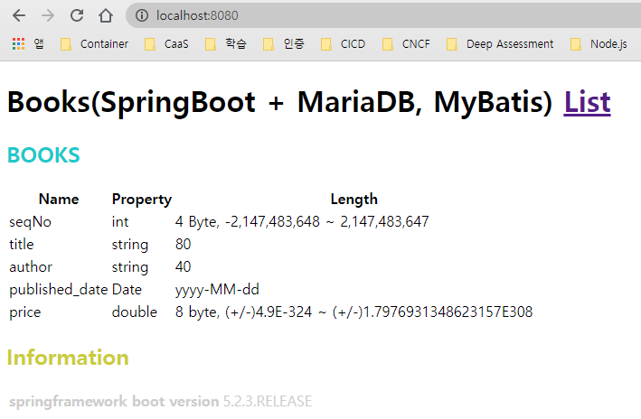
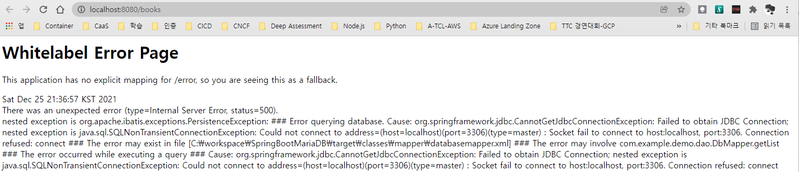

# SpringBoot MariaDB Sample

## 실행 환경
| 구분 | 항목 | 버전 |
|:---|:---|:---|
| 운영체계 | Windows | 10,11 | 
| 웹서버 | [Apache](https://httpd.apache.org/) | [2.4.52](https://www.apachelounge.com/download/) | 
| WAS 연계 모듈 | mod_jk | [1.2.48](https://www.apachelounge.com/download/VS16/modules/mod_jk-1.2.48-win64-VS16.zip) |  
| WAS 서버 | [Tomcat](https://tomcat.apache.org/) | [9.0.56](https://dlcdn.apache.org/tomcat/tomcat-9/v9.0.56/bin/apache-tomcat-9.0.56.exe) </br> [10.0.14](https://dlcdn.apache.org/tomcat/tomcat-10/v10.0.14/bin/apache-tomcat-10.0.14.exe) |  
| 개발/실행 도구 | [OpenJDK](https://openjdk.java.net/)| [17.0.1](https://jdk.java.net/17/) |  
| 통합개발환경 | [Visual Studio Code](https://code.visualstudio.com/) | 1.63.2 |   
| 프레임워크 | [Spring Boot](https://spring.io/projects/spring-boot) | 2.6.2 |  
| 빌드 툴 | [Maven](https://maven.apache.org/) | 2.5.2 | 
| 퍼시스턴스 프레임워크 | [myBatis](https://mybatis.org/mybatis-3/ko/index.html) | 3.4.1 | 
| 데이터베이스 | [MariaDB](https://mariadb.org/)| 10.8.0 | 


## MariaDB 정보
| 항목 | 내용 |
|:---|:---|
| port | 13306 |  
| user | tutorial | 
| database | tutorial | 
| table | tutorial |

### 테이블(tutorial)
| Field | Type | Null | Key | Default | Extra  |
|:---|:---|:---|:---|:---|:---|
| SeqNo          | int(11)     | NO   | PRI | NULL | auto_increment |
| Title          | varchar(20) | NO   |     | NULL |                |
| Author         | varchar(20) | NO   |     | NULL |                |
| Price          | double      | NO   |     | 0    |                |
| published_date | date        | NO   |     | NULL |                |

## 실행
```
./mnw spring-boot:run  
```

## 접속
http://localhost:8080/

### 정상 동작 화면
  
---   
  

#### 실행 로그
```powershell
PS C:\workspace\SpringBootMariaDB> ./mvnw spring-boot:run

[INFO] Scanning for projects...
[INFO] 
[INFO] --------------------< com.example:SpringBootSample >--------------------
[INFO] Building SpringBootSample 0.0.1-SNAPSHOT
[INFO] --------------------------------[ war ]---------------------------------
[INFO] 
[INFO] >>> spring-boot-maven-plugin:2.2.3.RELEASE:run (default-cli) > test-compile @ SpringBootSample >>>
[INFO] 
[INFO] --- maven-resources-plugin:3.1.0:resources (default-resources) @ SpringBootSample ---
[INFO] Using 'UTF-8' encoding to copy filtered resources.
[INFO] Copying 1 resource
[INFO] Copying 1 resource
[INFO]
[INFO] --- maven-compiler-plugin:3.8.1:compile (default-compile) @ SpringBootSample ---
[INFO] Nothing to compile - all classes are up to date
[INFO]
[INFO] --- maven-resources-plugin:3.1.0:testResources (default-testResources) @ SpringBootSample ---
[INFO] Using 'UTF-8' encoding to copy filtered resources.
[INFO] skip non existing resourceDirectory C:\workspace\SpringBootMariaDB\src\test\resources
[INFO]
[INFO] --- maven-compiler-plugin:3.8.1:testCompile (default-testCompile) @ SpringBootSample ---
[INFO] Nothing to compile - all classes are up to date
[INFO]
[INFO] <<< spring-boot-maven-plugin:2.2.3.RELEASE:run (default-cli) < test-compile @ SpringBootSample <<<
[INFO]
[INFO]
[INFO] --- spring-boot-maven-plugin:2.2.3.RELEASE:run (default-cli) @ SpringBootSample ---
[INFO] Attaching agents: []

  .   ____          _            __ _ _
 /\\ / ___'_ __ _ _(_)_ __  __ _ \ \ \ \
( ( )\___ | '_ | '_| | '_ \/ _` | \ \ \ \
 \\/  ___)| |_)| | | | | || (_| |  ) ) ) )
  '  |____| .__|_| |_|_| |_\__, | / / / /
 =========|_|==============|___/=/_/_/_/
 :: Spring Boot ::        (v2.2.3.RELEASE)

2021-12-26 12:47:21.118  INFO 24152 --- [           main] c.e.demo.SpringBootSampleApplication     : Starting SpringBootSampleApplication on DESKTOP-QR555PR with PID 24152 (C:\workspace\SpringBootMariaDB\target\classes started by taeey in C:\workspace\SpringBootMariaDB)
2021-12-26 12:47:21.120  INFO 24152 --- [           main] c.e.demo.SpringBootSampleApplication     : No active profile set, falling back to default profiles: default
2021-12-26 12:47:22.453  INFO 24152 --- [           main] o.s.b.w.embedded.tomcat.TomcatWebServer  : Tomcat initialized with port(s): 8080 (http)
2021-12-26 12:47:22.461  INFO 24152 --- [           main] o.apache.catalina.core.StandardService   : Starting service [Tomcat]
2021-12-26 12:47:22.461  INFO 24152 --- [           main] org.apache.catalina.core.StandardEngine  : Starting Servlet engine: [Apache Tomcat/9.0.30]
2021-12-26 12:47:22.639  INFO 24152 --- [           main] org.apache.jasper.servlet.TldScanner     : At least one JAR was scanned for TLDs yet contained no TLDs. Enable debug logging for this logger for a complete list of JARs that were scanned but no TLDs were found in them. Skipping unneeded JARs during scanning can improve startup time and JSP compilation time.
2021-12-26 12:47:22.646  INFO 24152 --- [           main] o.a.c.c.C.[Tomcat].[localhost].[/]       : Initializing Spring embedded WebApplicationContext
2021-12-26 12:47:22.647  INFO 24152 --- [           main] o.s.web.context.ContextLoader            : Root WebApplicationContext: initialization completed in 1502 ms
2021-12-26 12:47:22.855  INFO 24152 --- [           main] o.s.s.concurrent.ThreadPoolTaskExecutor  : Initializing ExecutorService 'applicationTaskExecutor'
2021-12-26 12:47:22.896  INFO 24152 --- [           main] o.s.b.a.w.s.WelcomePageHandlerMapping    : Adding welcome page template: index
2021-12-26 12:47:22.977  INFO 24152 --- [           main] o.s.b.w.embedded.tomcat.TomcatWebServer  : Tomcat started on port(s): 8080 (http) with context path ''
2021-12-26 12:47:22.980  INFO 24152 --- [           main] c.e.demo.SpringBootSampleApplication     : Started SpringBootSampleApplication in 2.093 seconds (JVM running for 2.356)
2021-12-26 12:47:32.980  INFO 24152 --- [nio-8080-exec-1] o.a.c.c.C.[Tomcat].[localhost].[/]       : Initializing Spring DispatcherServlet 'dispatcherServlet'
2021-12-26 12:47:32.981  INFO 24152 --- [nio-8080-exec-1] o.s.web.servlet.DispatcherServlet        : Initializing Servlet 'dispatcherServlet'
2021-12-26 12:47:32.986  INFO 24152 --- [nio-8080-exec-1] o.s.web.servlet.DispatcherServlet        : Completed initialization in 4 ms
2021-12-26 12:47:33.969  WARN 24152 --- [nio-8080-exec-1] o.a.c.util.SessionIdGeneratorBase        : Creation of SecureRandom instance for session ID generation using [SHA1PRNG] took [701] milliseconds.
2021-12-26 12:47:45.634  INFO 24152 --- [nio-8080-exec-2] com.zaxxer.hikari.HikariDataSource       : HikariPool-1 - Starting...
2021-12-26 12:47:45.667  INFO 24152 --- [nio-8080-exec-2] com.zaxxer.hikari.HikariDataSource       : HikariPool-1 - Start completed.
WARNING: An illegal reflective access operation has occurred
WARNING: Illegal reflective access by org.apache.ibatis.reflection.Reflector (file:/C:/Users/taeey/.m2/repository/org/mybatis/mybatis/3.4.1/mybatis-3.4.1.jar) to method java.lang.Object.finalize()
WARNING: Please consider reporting this to the maintainers of org.apache.ibatis.reflection.Reflector
WARNING: Use --illegal-access=warn to enable warnings of further illegal reflective access operations
WARNING: All illegal access operations will be denied in a future release
```

### 오류 화면(MariaDB 가 Running 되지 않을 경우)
  