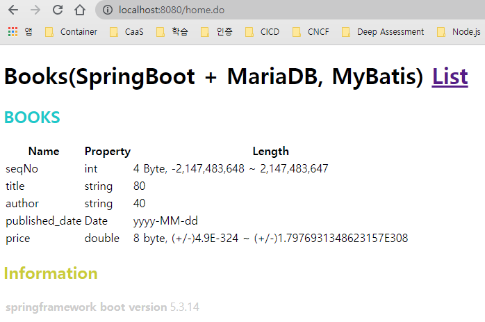

# Podman

Podman 은 Docker 와 동일하게 단일 노드에서 pod, 컨테이너 이미지 및 컨테이너를 관리  
Pod 라고 하는 컨테이너 및 컨테이너 그룹을 관리할 수 있는 libpod 라이브러리를 기반  

Windows 에서는 WSL2 (Ubuntu) 에서 podman 를 설치하고 실행할 수 있음
## 0. WSL 2 (Windows Subsysem for Linux 2) 실행
```
PS C:\workspace\SpringBootMySQL> wsl                                 
ubuntu@DESKTOP-QR555PR:/mnt/c/workspace/SpringBootMySQL$
```
## 1. 설치
```bash
# 패키지 색인 업데이트
sudo apt-get update -y

## Podman 저장소 추가
echo "deb https://download.opensuse.org/repositories/devel:/kubic:/libcontainers:/testing/xUbuntu_${VERSION_ID}/ /" | sudo tee /etc/apt/sources.list.d/devel:kubic:libcontainers:testing.list

##  ca-certificates패키지 설치 
echo "deb https://download.opensuse.org/repositories/devel:/kubic:/libcontainers:/testing/xUbuntu_${VERSION_ID}/ /" | sudo tee /etc/apt/sources.list.d/devel:kubic:libcontainers:testing.list

## 필요한 GPG 키를 다운로드하고 추가
curl -L "https://download.opensuse.org/repositories/devel:/kubic:/libcontainers:/testing/xUbuntu_${VERSION_ID}/Release.key" | sudo apt-key add -

##  패키지 색인을 다시 업데이트
sudo apt-get update -y

## Podman 설치
sudo apt-get install -y podman

## 확인
podman info
```

## 2. container 빌드
podman build --tag springmariadb:0.1 .  
```
ubuntu@DESKTOP-QR555PR:/mnt/c/workspace/SpringBootMariaDB$ podman build --tag springmysql:0.2 .
STEP 1/13: FROM openjdk:8-jdk-alpine
STEP 2/13: RUN addgroup -S spring && adduser -S spring -G spring
--> Using cache d9df759cf970ffc567b8e8cf8b7dca627fe0ee8592b3aa27f0391c8d2372f1c4
--> d9df759cf97
STEP 3/13: USER spring:spring
--> Using cache f6ea3ad94d67bb6fcd916eb1b057c16d8f0a5e356d6642e4989a374450cf0d27
--> f6ea3ad94d6
STEP 4/13: ARG WAR_FILE=target/*.war
--> Using cache c384f0448f70c214d4ed729d15e57257aaec64004b24d88f2ec082e8577dbc36
--> c384f0448f7
STEP 5/13: ARG APP_NAME=app
--> Using cache 89188dbada600e4cdb966742b160a7e9ab60a6f8179eae6dbf13edfefbab9b8a
--> 89188dbada6
STEP 6/13: ARG DEPENDENCY=target/classes
--> Using cache 1a7bb7d4111ed45410b697eb0b2c129bd898c1c364de319b760f010a3f2131b4
--> 1a7bb7d4111
STEP 7/13: RUN mkdir -p /home/spring
--> Using cache c0bfb4a7bf016d6d89c3dd18bd4fa529810322f67c30d6ef9a68e42ad9b2cffa
--> c0bfb4a7bf0
STEP 8/13: WORKDIR /home/spring
--> Using cache 0ccea1936ea2b3d7243245b9ac7cc97e6d6a6de30cee781af934b2b48105b14b
--> 0ccea1936ea
STEP 9/13: COPY ${WAR_FILE} /home/spring/app.war
--> c9602f65b38
STEP 10/13: COPY jmx-exporter/jmx_prometheus.yml /home/spring/jmx_prometheus.yml
--> 255c6ea6181
STEP 11/13: COPY ./jmx-exporter/jmx_prometheus_javaagent-0.16.1.jar /home/spring/jmx_prometheus_javaagent.jar
^Cubuntu@DESKTOP-QR555PR:/mnt/c/workspace/SpringBootMariaDB$ ^C
ubuntu@DESKTOP-QR555PR:/mnt/c/workspace/SpringBootMariaDB$ podman build --tag springmariadb:0.1 . 
STEP 1/13: FROM openjdk:8-jdk-alpine
STEP 2/13: RUN addgroup -S spring && adduser -S spring -G spring
--> Using cache d9df759cf970ffc567b8e8cf8b7dca627fe0ee8592b3aa27f0391c8d2372f1c4
--> d9df759cf97
STEP 3/13: USER spring:spring
--> Using cache f6ea3ad94d67bb6fcd916eb1b057c16d8f0a5e356d6642e4989a374450cf0d27
--> f6ea3ad94d6
STEP 4/13: ARG WAR_FILE=target/*.war
--> Using cache c384f0448f70c214d4ed729d15e57257aaec64004b24d88f2ec082e8577dbc36
--> c384f0448f7
STEP 5/13: ARG APP_NAME=app
--> Using cache 89188dbada600e4cdb966742b160a7e9ab60a6f8179eae6dbf13edfefbab9b8a
--> 89188dbada6
STEP 6/13: ARG DEPENDENCY=target/classes
--> Using cache 1a7bb7d4111ed45410b697eb0b2c129bd898c1c364de319b760f010a3f2131b4
--> 1a7bb7d4111
STEP 7/13: RUN mkdir -p /home/spring
--> Using cache c0bfb4a7bf016d6d89c3dd18bd4fa529810322f67c30d6ef9a68e42ad9b2cffa
--> c0bfb4a7bf0
STEP 8/13: WORKDIR /home/spring
--> Using cache 0ccea1936ea2b3d7243245b9ac7cc97e6d6a6de30cee781af934b2b48105b14b
--> 0ccea1936ea
STEP 9/13: COPY ${WAR_FILE} /home/spring/app.war
--> Using cache c9602f65b38fa8497c19acf6a9d2346d912fd06da44aba15eceabfdde6f5588d
--> c9602f65b38
STEP 10/13: COPY jmx-exporter/jmx_prometheus.yml /home/spring/jmx_prometheus.yml
--> Using cache 255c6ea6181308609263fe1c336769c33a340bad4614093d6747668839f5bc21
--> 255c6ea6181
STEP 11/13: COPY ./jmx-exporter/jmx_prometheus_javaagent-0.16.1.jar /home/spring/jmx_prometheus_javaagent.jar
--> 15c46443566
STEP 12/13: EXPOSE 8088
--> 8951d1dd1d5
STEP 13/13: ENTRYPOINT java -cp app:app/lib/* -Xms512m -Xmx512m -XX:NewSize=256m -XX:MaxNewSize=256m -XX:MaxMetaspaceSize=128m -XX:MetaspaceSize=128m -XX:ParallelGCThreads=3           -XX:+PrintGCDetails -XX:+PrintGCDateStamps -XX:+PrintHeapAtGC -Xloggc:/gclog/gc_${HOSTNAME}_$(date +%Y%m%d%H%M%S).log -Dgclog_file=/gclog/gc_${HOSTNAME}_$(date +%Y%m%d%H%M%S).log           -XX:+HeapDumpOnOutOfMemoryError -XX:HeapDumpPath=/gclog/${HOSTNAME}.log              -javaagent:/home/spring/jmx_prometheus_javaagent.jar=8090:/home/spring/jmx_prometheus.yml               -Djava.security.egd=file:/dev/./urandom -jar /home/spring/app.war
COMMIT springmariadb:0.1
--> 9b640251d70
Successfully tagged localhost/springmariadb:0.1
9b640251d70010c86699d2711ba07861d77a92e5e1305af62a9ce83e1e3663d0
ubuntu@DESKTOP-QR555PR:/mnt/c/workspace/SpringBootMariaDB$ 
```

## 3. 생성된 이미지 확인
podman images  
```
ubuntu@DESKTOP-QR555PR:/mnt/c/workspace/SpringBootMariaDB$ podman images 
REPOSITORY                 TAG           IMAGE ID      CREATED             SIZE
localhost/springmariadb    0.1           9b640251d700  About a minute ago  136 MB
localhost/springmysql      0.1           c94bf69eeb87  38 minutes ago      138 MB
docker.io/library/openjdk  8-jdk-alpine  a3562aa0b991  2 years ago         106 MB
ubuntu@DESKTOP-QR555PR:/mnt/c/workspace/SpringBootMariaDB$ 
```

## 4. 실행
podman run --network=host springmariadb:0.1 --name springmariadb -p 8080:8080 -d -it  
```
ubuntu@DESKTOP-QR555PR:/mnt/c/workspace/SpringBootMariaDB$ podman run --network=host springmariadb:0.1 --name springmariadb -p 8080:8080 -d -it  
OpenJDK 64-Bit Server VM warning: Cannot open file /gclog/gc_DESKTOP-QR555PR_20220209152540.log due to No such file or directory


  .   ____          _            __ _ _
 /\\ / ___'_ __ _ _(_)_ __  __ _ \ \ \ \
( ( )\___ | '_ | '_| | '_ \/ _` | \ \ \ \
 \\/  ___)| |_)| | | | | || (_| |  ) ) ) )
  '  |____| .__|_| |_|_| |_\__, | / / / /
 =========|_|==============|___/=/_/_/_/
 :: Spring Boot ::                (v2.6.2)

2022-02-09 15:25:41.364  INFO 1 --- [           main] c.e.demo.SpringBootSampleApplication     : Starting SpringBootSampleApplication v0.0.1-SNAPSHOT using Java 1.8.0_212 on DESKTOP-QR555PR with PID 1 (/home/spring/app.war started by spring in /home/spring)
2022-02-09 15:25:41.368  INFO 1 --- [           main] c.e.demo.SpringBootSampleApplication     : No active profile set, falling back to default profiles: default
2022-02-09 15:25:42.229  INFO 1 --- [           main] o.s.b.w.embedded.tomcat.TomcatWebServer  : Tomcat initialized with port(s): 8080 (http)
2022-02-09 15:25:42.240  INFO 1 --- [           main] o.apache.catalina.core.StandardService   : Starting service [Tomcat]
2022-02-09 15:25:42.240  INFO 1 --- [           main] org.apache.catalina.core.StandardEngine  : Starting Servlet engine: [Apache Tomcat/9.0.56]
2022-02-09 15:25:43.010  INFO 1 --- [           main] org.apache.jasper.servlet.TldScanner     : At least one JAR was scanned for TLDs yet contained no TLDs. Enable debug logging for this logger for a complete list of JARs that were scanned but no TLDs were found in them. Skipping unneeded JARs during scanning can improve startup time and JSP compilation time.
2022-02-09 15:25:43.252  INFO 1 --- [           main] o.a.c.c.C.[Tomcat].[localhost].[/]       : Initializing Spring embedded WebApplicationContext
2022-02-09 15:25:43.252  INFO 1 --- [           main] w.s.c.ServletWebServerApplicationContext : Root WebApplicationContext: initialization completed in 1833 ms
2022-02-09 15:25:43.949  INFO 1 --- [           main] o.s.b.w.embedded.tomcat.TomcatWebServer  : Tomcat started on port(s): 8080 (http) with context path ''
2022-02-09 15:25:43.961  INFO 1 --- [           main] c.e.demo.SpringBootSampleApplication     : Started SpringBootSampleApplication in 2.896 seconds (JVM running for 3.423)
2022-02-09 15:25:49.592  INFO 1 --- [nio-8080-exec-1] o.a.c.c.C.[Tomcat].[localhost].[/]       : Initializing Spring DispatcherServlet 'dispatcherServlet'
2022-02-09 15:25:49.592  INFO 1 --- [nio-8080-exec-1] o.s.web.servlet.DispatcherServlet        : Initializing Servlet 'dispatcherServlet'
2022-02-09 15:25:49.593  INFO 1 --- [nio-8080-exec-1] o.s.web.servlet.DispatcherServlet        : Completed initialization in 1 ms
```

## 5. 접속 테스트
### curl localhost:8080
```powershell
ubuntu@DESKTOP-QR555PR:/mnt/c/workspace/SpringBootMySQL$ curl localhost:8080
{"timestamp":"2022-02-09T15:26:49.363+00:00","status":404,"error":"Not Found","path":"/"}ubuntu@DESKTOP-QR555PR:/mnt/c/workspace/SpringBootMySQL$ curl localhost:8080/home.do


<!DOCTYPE html>
<html>
<head>
<meta charset="EUC-KR">
<title>MAIN PAGE</title>
</head>
<body>
    <h1>Books(SpringBoot + MariaDB, MyBatis) <a href="/books.do">List</a></h1>
    <H2> <font color="#00cccc">BOOKS</font></H2>
    <table>
    <tr>
    <th>Name</th>
    <th>Property</th>
    <th>Length</th>
    </tr>
    <tr> <td> seqNo </td><td> int </td><td>4 Byte, -2,147,483,648 ~ 2,147,483,647</td> </tr>
    <tr> <td> title </td><td> string </td><td>80</td> </tr>
    <tr> <td> author </td><td> string </td><td>40</td> </tr>
    <tr> <td> published_date </td><td> Date </td><td>yyyy-MM-dd</td></tr>
    <tr> <td> price </td><td> double </td><td>8 byte, (+/-)4.9E-324 ~ (+/-)1.7976931348623157E308</td></tr>
    </table>
    <H2> <font color="#cccc00">Information</font></H2>
    <table>
        <tr>
            <th><font color="#cccccc">springframework boot version</font></th>
            <td><font color="#cccccc">5.3.14</font></td>
        </tr>
    </table>
</body>
</html>ubuntu@DESKTOP-QR555PR:/mnt/c/workspace/SpringBootMySQL$
ubuntu@DESKTOP-QR555PR:/mnt/c/workspace/SpringBootMySQL$
```
### http://localhost:8080/home.do  
  

## 6. 조회 및 삭제
podman ps -a  
```
ubuntu@DESKTOP-QR555PR:/mnt/c/workspace/SpringBootMariaDB$ podman rm $(podman ps -a -q)
fb044858c99551fe55be6da669283889cd95e74295ce017efe8e7b4d8fc0a065
e33e93576615500f1f17d0e2fed2830abf7342b905cdf17feb69014c1f5575c8
Error: cannot remove container c299ade2fa041b45c0deb999674e143bee849bfb3731b340417016ed64c0878e as it is running - running or paused containers cannot be removed without force: container state improper
ubuntu@DESKTOP-QR555PR:/mnt/c/workspace/SpringBootMariaDB$
```

podman rm $(podman ps -a -q)  
```
ubuntu@DESKTOP-QR555PR:/mnt/c/workspace/SpringBootMariaDB$ podman rm $(podman ps -a -q)
c299ade2fa041b45c0deb999674e143bee849bfb3731b340417016ed64c0878e
ubuntu@DESKTOP-QR555PR:/mnt/c/workspace/SpringBootMariaDB$ podman ps -a
CONTAINER ID  IMAGE       COMMAND     CREATED     STATUS      PORTS       NAMES
ubuntu@DESKTOP-QR555PR:/mnt/c/workspace/SpringBootMariaDB$
```